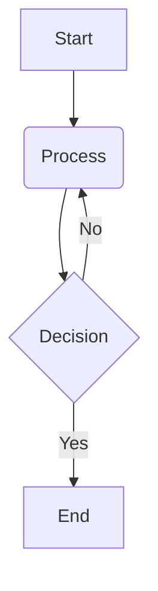

+++
# --- Basic Metadata ---
id = ""
title = ""
status = "draft"
created_date = ""
updated_date = ""
version = "1.0"
tags = []
template_schema_doc = ".ruru/templates/toml-md/00_boilerplate.README.md" # Link to schema documentation

# --- Ownership & Context ---
# author = ""
# owner = ""
# related_docs = []
# related_tasks = []
# parent_doc = ""

# --- Document Type Specific Fields ---
# Add fields specific to the type of document this template represents

# --- AI Interaction Hints (Optional) ---
# context_type = ""
# target_audience = []
# granularity = ""
+++

# << HUMAN_READABLE_TITLE >>

## Overview / Purpose 🎯

*   Briefly explain the purpose of this document.
*   What problem does it solve or what information does it provide?

## Content Section 1 📝

*   Use standard Markdown for content.
*   Employ headings, lists, code blocks, etc., as needed.

## Content Section 2 ✅

*   Use GFM checklists if applicable: `- [ ] Item 1`

## Diagrams / Visuals 📊 (Optional)

## Key Learnings / Summary 💡 (Optional)

*   Summarize important takeaways or discoveries.

## Related Links 🔗 (Optional)

*   [Link Text](URL or path)