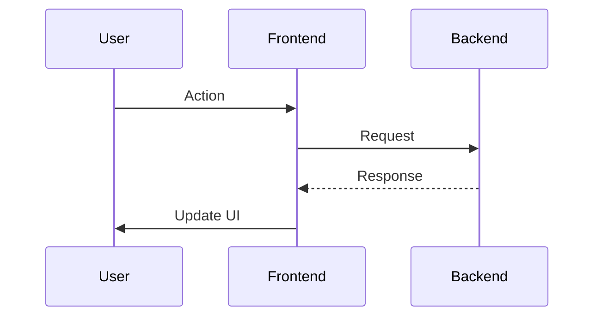

+++
id = ""
title = ""
status = "🟡 To Do"
type = "🌟 Feature"
priority = "▶️ Medium"
created_date = ""
updated_date = ""
# due_date = ""
# estimated_effort = ""
assigned_to = ""
# reporter = ""
parent_task = ""
depends_on = []
related_docs = []
tags = []
template_schema_doc = ".ruru/templates/toml-md/01_mdtm_feature.README.md" # Link to schema documentation
# ai_prompt_log = """"""
# review_checklist = []
# reviewed_by = ""
# key_learnings = ""
+++

# << CONCISE FEATURE TITLE >>

## Description ✍️

*   **What is this feature?**
*   **Why is it needed?**
*   **Scope:**
*   **Links:**

## Acceptance Criteria ✅

*   - [ ] Criterion 1:
*   - [ ] Criterion 2:
*   - [ ] Criterion 3:
*   - [ ] ...

## Implementation Notes / Sub-Tasks 📝

*   (Optional: Break down the feature)
*   (e.g., `- [ ] Create Component`)

## Diagrams 📊 (Optional)

## AI Prompt Log 🤖 (Optional)

*   (Log key prompts and AI responses)

## Review Notes 👀 (For Reviewer)

*   (Space for feedback)

## Key Learnings 💡 (Optional - Fill upon completion)

*   (Summarize discoveries)