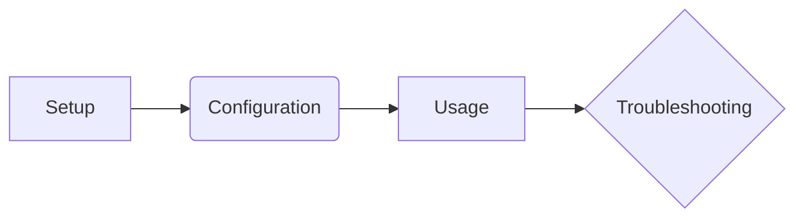

+++
id = ""
title = ""
status = "draft"
doc_version = ""
content_version = 1.0
audience = []
last_reviewed = ""
template_schema_doc = ".templates/toml-md/09_documentation.README.md" # Link to schema documentation
# owner = ""
tags = []
# parent_doc = ""
# related_tasks = []
# related_context = []
+++

# << HUMAN_READABLE_DOCUMENT_TITLE >>

**(Optional) Version:** << Documented Feature Version >> | **Content Revision:** << Content Version >> | **Last Reviewed:** << YYYY-MM-DD >>

## Introduction / Overview 🎯

*   What is this document about?
*   What purpose does it serve?
*   Who is the intended audience?

## Section 1: << Title >> 📝

*   Content using standard Markdown.

```javascript
// Example code block
function example() {
  return true;
}
```

## Section 2: << Title >> ✅

*   More content.

## Diagrams / Visuals 📊 (Optional)



## Summary / Key Takeaways 💡 (Optional)

*   Briefly summarize the main points covered.

## Related Links / Further Reading 🔗 (Optional)

*   Links to other relevant documentation, source code, or external resources.