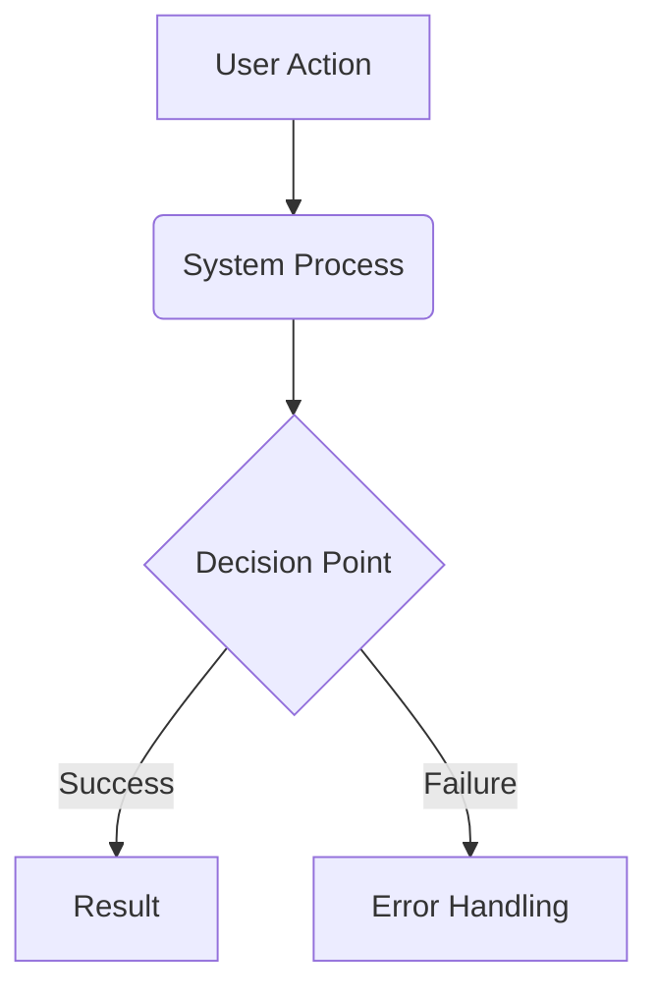

+++
# --- Basic Metadata ---
id = ""               # << UNIQUE_IDENTIFIER (e.g., PLAN-FEAT-NNN) >>
title = ""            # << HUMAN_READABLE_TITLE_OF_PROPOSAL >>
status = "draft"      # << Options: draft, proposed, accepted, rejected, implemented, deferred >>
created_date = ""     # << YYYY-MM-DD >>
updated_date = ""     # << YYYY-MM-DD >>
version = "1.0"       # << Proposal version >>
tags = ["planning", "proposal", "feature"] # << Add relevant keywords >>
template_schema_doc = ".ruru/templates/toml-md/17_feature_proposal.README.md" # Link to schema documentation (to be created)

# --- Ownership & Context ---
proposed_by = ""      # << User/Team proposing the feature >>
# owner = ""            # << Optional: User/Team responsible if accepted >>
related_docs = []     # << Optional: List paths/URLs to related specs, research, etc. >>
related_tasks = []    # << Optional: List related MDTM task IDs (e.g., spike tasks) >>
# parent_doc = ""       # Optional: Path/ID of parent planning document

# --- Proposal Specific Fields ---
priority = "medium"   # << Options: low, medium, high, critical >>
estimated_effort = "" # << Optional: e.g., Small, Medium, Large, T-Shirt Size, Story Points >>
# target_release = ""   # << Optional: Target version or timeframe >>

# --- AI Interaction Hints (Optional) ---
context_type = "planning"
target_audience = ["all"]
granularity = "detailed"
+++

# << HUMAN_READABLE_TITLE_OF_PROPOSAL >>

## 1. Overview / Purpose 🎯

*   Briefly summarize the proposed feature and its main goal.
*   What user problem or business need does this feature address?

## 2. Problem Statement 🤔

*   Describe the current situation and the specific problem(s) this feature aims to solve.
*   Why is solving this problem important? What is the impact of *not* solving it?

## 3. Proposed Solution ✨

*   Describe the proposed feature in detail. How will it work from the user's perspective?
*   Include mockups, user flows, or diagrams if helpful.

## 4. Goals ✅

*   List the specific, measurable objectives this feature aims to achieve.
*   How will success be measured?

## 5. Non-Goals ❌

*   Clearly state what is *out of scope* for this feature proposal.
*   What related problems or functionality will *not* be addressed?

## 6. Technical Design / Implementation Sketch 🛠️ (Optional)

*   Outline the proposed technical approach at a high level.
*   Mention key components, technologies, APIs, data models, etc.
*   Consider potential impacts on existing systems.

## 7. Alternatives Considered 🔄 (Optional)

*   Briefly describe other potential solutions that were considered.
*   Why was the proposed solution chosen over the alternatives?

## 8. Open Questions / Risks ❓

*   List any unresolved questions, dependencies, or potential risks associated with this proposal.

## 9. Diagrams / Visuals 📊 (Optional)

## 10. Related Links 🔗 (Optional)

*   [Link Text](URL or path to relevant docs, research, etc.)