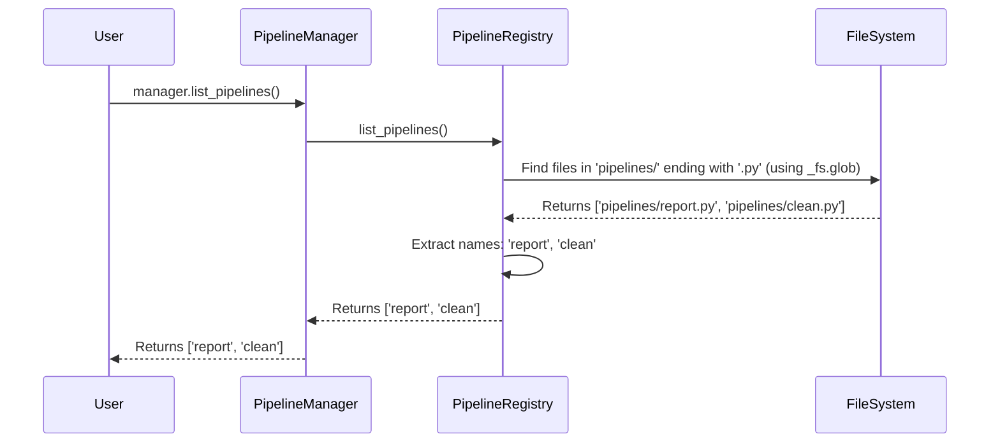

# Chapter 1: The Project Librarian - PipelineRegistry

Welcome to the `flowerpower` project! If you're new to building data pipelines, you're in the right place. We'll guide you step-by-step through the core ideas.

Imagine joining a big team working on many different data tasks. Maybe one task fetches user data, another cleans it, and a third generates reports. Each of these tasks can be thought of as a "pipeline". How do you know which pipelines already exist? How do you add a new one for your specific task? How do you get details about an existing one? This is where our project's "librarian" comes in: the `PipelineRegistry`.

## What's the Problem?

In any reasonably sized project, you'll end up with multiple pipelines. Keeping track of them manually can become messy:
*   Where is the code for the "user-report" pipeline?
*   Is there already a pipeline that cleans product data?
*   How do I add a new, simple pipeline for testing an idea?
*   How do I safely remove a pipeline we don't use anymore?

Without a system, finding, adding, or removing pipelines can be confusing and error-prone.

## Meet the Librarian: `PipelineRegistry`

The `PipelineRegistry` is a core part of `flowerpower` that solves this organization problem. Think of it exactly like a helpful librarian for your project's pipelines.

*   **Knows Where Everything Is:** The `PipelineRegistry` knows the standard places within your project folder where pipeline code (`.py` files) and their configurations (`.yml` files) are stored.
*   **Keeps a Catalog:** It can quickly tell you which pipelines are available in the project.
*   **Helps You Find Details:** Need to know more about a specific pipeline? The registry can fetch its summary (like its configuration settings or even its code).
*   **Assists with New Additions:** It helps you create the basic files needed for a brand new pipeline using standard templates.
*   **Handles Removals:** If a pipeline is no longer needed, the registry helps you remove its files cleanly.
*   **Manages Special Instructions (Hooks):** Sometimes pipelines need extra setup or cleanup steps. The registry helps manage these "hooks".

Essentially, `PipelineRegistry` handles the *inventory* and basic management of your pipelines.

## How to Interact with the Librarian

While `PipelineRegistry` does the background work, you usually interact with it *through* another component called the [PipelineManager](02_pipelinemanager_.md) (which we'll cover in the next chapter). The `PipelineManager` acts like the main help desk, and it uses the `PipelineRegistry` (our librarian) to handle pipeline inventory tasks.

Let's see some common actions you might perform via the `PipelineManager`, which rely on the `PipelineRegistry`:

**1. Listing Available Pipelines**

You want to see all the pipelines currently in the project.

```python
# Assuming 'manager' is an instance of PipelineManager
available_pipelines = manager.list_pipelines()
print(available_pipelines)
```

*Explanation:* You ask the `manager` to list pipelines. Internally, the `manager` asks the `PipelineRegistry` to look into the designated pipeline folder and return the names of all `*.py` files found there.

*Example Output:*
```
['daily_report', 'data_cleansing', 'user_signup_processor']
```

**2. Creating a New Pipeline**

You need to create a basic structure for a new pipeline called `simple_etl`.

```python
# Tells the registry to create the necessary files
manager.new('simple_etl')
```

*Explanation:* You tell the `manager` you want a new pipeline named `simple_etl`. The `manager` instructs the `PipelineRegistry` to:
1.  Create a new Python file: `pipelines/simple_etl.py` with some basic template code.
2.  Create a corresponding configuration file: `conf/pipelines/simple_etl.yml` with default settings.

*Example Output (Console Message):*
```
🔧 Created new pipeline [bold blue]your_project_name.simple_etl[/bold blue]
```
(Where `your_project_name` comes from your project settings).

**3. Getting Details about a Pipeline**

You want to see the configuration and code for the `data_cleansing` pipeline.

```python
# Get a summary dictionary
summary = manager.get_summary('data_cleansing')

# You can also print a formatted view directly
manager.show_summary('data_cleansing')
```

*Explanation:* You ask the `manager` for details about `data_cleansing`. The `manager` uses the `PipelineRegistry` to:
1.  Find and read the configuration file (`conf/pipelines/data_cleansing.yml`).
2.  Find and read the code file (`pipelines/data_cleansing.py`).
3.  Return this information, often formatted nicely by `show_summary`.

**4. Removing a Pipeline**

The `simple_etl` pipeline was just for testing, and you want to remove it.

```python
# Remove the configuration file by default
manager.delete('simple_etl')

# To also remove the code file (use with caution!)
# manager.delete('simple_etl', module=True)
```

*Explanation:* You ask the `manager` to delete `simple_etl`. The `manager` tells the `PipelineRegistry` to remove the associated configuration file (`conf/pipelines/simple_etl.yml`). If you explicitly ask (`module=True`), it will also remove the code file (`pipelines/simple_etl.py`). Be careful when deleting code!

## Under the Hood: How Does the Librarian Work?

Let's peek behind the curtain. How does `PipelineRegistry` actually *do* these things?

**The Setup:**

When the `PipelineRegistry` is created (usually automatically by the `PipelineManager`), it's given a few key pieces of information:

*   **Project Configuration:** General settings about your project.
*   **Filesystem Access (`fs`):** A tool to interact with the project's files, whether they are on your local disk, in the cloud (like S3), or elsewhere. This is handled by our [Filesystem Abstraction](05_filesystem_abstraction__fsspec_wrappers_helpers_.md).
*   **Configuration Directory (`cfg_dir`):** The path where configuration files are stored (e.g., `conf/`).
*   **Pipelines Directory (`pipelines_dir`):** The path where pipeline code files are stored (e.g., `pipelines/`).

```python
# Simplified look at the registry's initialization
class PipelineRegistry:
    def __init__(self, project_cfg, fs, cfg_dir, pipelines_dir):
        self.project_cfg = project_cfg # Project settings
        self._fs = fs                 # Tool to read/write files
        self._cfg_dir = cfg_dir       # Path to config folder
        self._pipelines_dir = pipelines_dir # Path to code folder
        # ... other setup ...
```
*Explanation:* The `__init__` method just stores these important pieces of information so other methods in the registry can use them later.

**Example: Listing Pipelines**

Let's trace what happens when you call `manager.list_pipelines()`:



*Explanation:*
1.  The `PipelineManager` asks the `PipelineRegistry`.
2.  The `PipelineRegistry` uses its filesystem tool (`_fs`) to look inside the `_pipelines_dir` for all files ending in `.py`.
3.  The filesystem tool returns the list of full paths.
4.  The `PipelineRegistry` extracts just the base names (without `.py`).
5.  This list of names is returned to the `PipelineManager`, and then to you.

Here’s a simplified view of the code involved:

```python
# Simplified version of how names are retrieved
class PipelineRegistry:
    # ... (init stuff) ...

    def _get_files(self) -> list[str]:
        # Use the filesystem tool to find Python files
        # in the pipeline directory
        path_pattern = posixpath.join(self._pipelines_dir, "*.py")
        return self._fs.glob(path_pattern) # e.g., ['pipelines/report.py']

    def list_pipelines(self) -> list[str]:
        files = self._get_files()
        # Extract just the name part from the file path
        # e.g., 'pipelines/report.py' becomes 'report'
        names = [posixpath.basename(f).replace(".py", "") for f in files]
        return names
```
*Explanation:* The `_get_files` method constructs the path pattern (like `pipelines/*.py`) and uses the filesystem (`self._fs`) to find matching files. `list_pipelines` then calls `_get_files` and cleans up the paths to get simple names.

**Example: Creating a New Pipeline (`new`)**

When you call `manager.new('my_pipeline')`:

1.  The `PipelineManager` calls `registry.new('my_pipeline')`.
2.  The `PipelineRegistry` checks if files like `pipelines/my_pipeline.py` or `conf/pipelines/my_pipeline.yml` already exist (unless `overwrite=True`).
3.  It uses the filesystem tool (`_fs`) to create the directories if they don't exist (e.g., `pipelines/` and `conf/pipelines/`).
4.  It uses `_fs.open(...)` to write the template content into `pipelines/my_pipeline.py`.
5.  It creates a default [Configuration](03_configuration__config___projectconfig___pipelineconfig__.md) object (`PipelineConfig`) and saves it to `conf/pipelines/my_pipeline.yml` using `_fs`.

This ensures that a new pipeline always starts with the necessary files in the correct locations.

## Conclusion

You've learned about the `PipelineRegistry`, the essential "librarian" within `flowerpower`. It doesn't run pipelines, but it's crucial for keeping them organized. It helps you:

*   Discover existing pipelines (`list_pipelines`).
*   Create new ones from templates (`new`).
*   Get details about specific pipelines (`get_summary`).
*   Remove pipelines cleanly (`delete`).

Remember, you'll typically use these features through the main `PipelineManager`, which acts as the front desk, relying on the `PipelineRegistry` for all inventory-related tasks.

In the next chapter, we'll dive into that main coordinator: the [PipelineManager](02_pipelinemanager_.md), and see how it uses the registry and other components to actually *run* and manage your pipelines.

---

Generated by [AI Codebase Knowledge Builder](https://github.com/The-Pocket/Tutorial-Codebase-Knowledge)