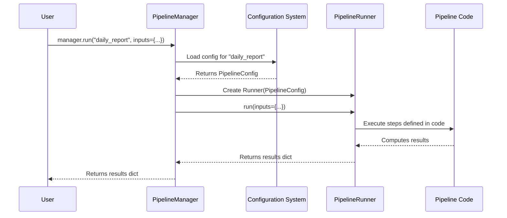

# Chapter 2: The Project Manager - PipelineManager

In [Chapter 1: The Project Librarian - PipelineRegistry](01_pipelineregistry_.md), we met the `PipelineRegistry`, our helpful librarian that keeps track of all the pipelines in our `flowerpower` project. We learned how it helps list, create, and find details about pipelines.

But knowing *what* pipelines exist is only half the story. How do we actually *run* them? How do we tell the "daily\_report" pipeline to start processing data? How do we schedule it to run automatically every morning?

## What's the Problem?

Imagine you have your list of pipelines from the librarian (`PipelineRegistry`). Now you want to:

*   Run the `daily_report` pipeline right now.
*   Run the `data_cleansing` pipeline, but as a background task so you can continue working.
*   Schedule the `user_signup_processor` to run every hour.
*   See a visual map of how the `data_cleansing` pipeline works.
*   Copy a pipeline from another project into this one.

The `PipelineRegistry` doesn't do these things. It only manages the *list* of pipelines. We need a central coordinator, a "project manager," to handle all these *actions*.

## Meet the Project Manager: `PipelineManager`

The `PipelineManager` is the central hub for all activities related to your pipelines in `flowerpower`. Think of it as the main control panel or the project manager overseeing everything.

*   **The Boss:** It takes your requests (like "run this pipeline" or "schedule that pipeline").
*   **The Delegator:** It doesn't do all the work itself. It uses other specialized components to get things done:
    *   It asks the [PipelineRegistry](01_pipelineregistry_.md) (our librarian) when it needs to know about available pipelines or create new ones.
    *   It uses the [PipelineRunner](04_pipelinerunner_.md) (the engine) to actually execute the steps within a pipeline.
    *   It works with the [JobQueueManager / PipelineJobQueue](08_jobqueuemanager___pipelinejobqueue_.md) (the scheduler/background task manager) to run pipelines later or repeatedly.
    *   It uses the `PipelineVisualizer` to create diagrams of pipelines.
    *   It uses the `PipelineIOManager` to import pipelines from or export them to other locations.
*   **Unified Interface:** It provides you with one consistent place to perform all these different actions.

Essentially, `PipelineManager` is your main point of interaction for *doing things* with your pipelines.

## How to Interact with the Project Manager

Let's see how you'd use the `PipelineManager` to solve our common use case: running the `daily_report` pipeline.

**1. Getting the Manager**

First, you need an instance of the `PipelineManager`. This usually connects to your project's settings and file structure.

```python
from flowerpower.pipeline import PipelineManager

# Create a manager for your project
# (It figures out project details automatically)
manager = PipelineManager()
```

*Explanation:* We import the `PipelineManager` class and create an object `manager`. This object is now our control panel for the project. It automatically loads your project's settings (we'll learn more about this in [Chapter 3: Configuration](03_configuration__config___projectconfig___pipelineconfig__.md)).

**2. Running a Pipeline (The Core Use Case)**

Now, let's tell the manager to run the `daily_report` pipeline.

```python
# Tell the manager to run the 'daily_report' pipeline
print("Starting the daily report...")
results = manager.run(name="daily_report")
print("Report finished!")
print("Results:", results)
```

*Explanation:*
*   We call the `.run()` method on our `manager` object.
*   We pass the `name` of the pipeline we want to run (`"daily_report"`).
*   The `manager` finds the pipeline, sets it up, runs it step-by-step, and waits for it to finish.
*   The `run` method returns a dictionary containing the final outputs of the pipeline.

*Example Output:*
```
Starting the daily report...
Report finished!
Results: {'report_path': '/path/to/project/data/output/daily_report_2023-10-27.csv', 'record_count': 1500}
```
*(The exact output depends on what the `daily_report` pipeline actually does).*

## Other Things the Manager Can Do

The `PipelineManager` is versatile. Here are other common tasks you'll use it for (we'll explore the components it uses for these in later chapters):

**Running as a Background Job:**

Sometimes pipelines take a long time. You can ask the manager to run it in the background using the [JobQueueManager / PipelineJobQueue](08_jobqueuemanager___pipelinejobqueue_.md).

```python
# Add the pipeline to the background job queue
job_id = manager.add_job(name="data_cleansing", inputs={"source": "raw_data.csv"})
print(f"Data cleansing added to queue with ID: {job_id}")
# Your script can continue running while the job processes
```

*Explanation:* `add_job` sends the pipeline task to a separate worker process. The manager relies on the [JobQueueManager / PipelineJobQueue](08_jobqueuemanager___pipelinejobqueue_.md) for this.

**Scheduling a Pipeline:**

Need the report to run every morning at 8 AM?

```python
# Schedule 'daily_report' using a cron string
schedule_id = manager.schedule(name="daily_report", cron="0 8 * * *")
print(f"Daily report scheduled with ID: {schedule_id}")
```

*Explanation:* `schedule` sets up a recurring task using the [JobQueueManager / PipelineJobQueue](08_jobqueuemanager___pipelinejobqueue_.md).

**Visualizing a Pipeline:**

Want to see a flowchart of how `data_cleansing` works?

```python
# Save a diagram of the pipeline as a PNG file
manager.save_dag(name="data_cleansing", format="png")
print("Saved data_cleansing.png")
```

*Explanation:* The manager uses its internal `PipelineVisualizer` component to generate the diagram.

**Managing Pipelines (using the Librarian):**

Need to list, create, or delete pipelines? The manager delegates these tasks to the [PipelineRegistry](01_pipelineregistry_.md).

```python
# List pipelines (delegates to registry)
available = manager.list_pipelines()
print("Available pipelines:", available)

# Create a new skeleton pipeline (delegates to registry)
manager.new("experimental_feature")
```

**Importing/Exporting Pipelines:**

Need to copy a pipeline from another project?

```python
# Import 'user_analysis' from another project directory
manager.import_pipeline(name="user_analysis", src_base_dir="/path/to/other/project")
print("Imported user_analysis pipeline.")
```

*Explanation:* The manager uses its internal `PipelineIOManager` component for this.

## Under the Hood: How Does the Manager Work?

Let's peek behind the curtain when you call `manager.run("daily_report")`.

**1. Initialization:**

When you create the `PipelineManager` (`manager = PipelineManager()`), it does some setup:
*   Finds your project's root directory.
*   Loads the main project configuration ([Configuration](03_configuration__config___projectconfig___pipelineconfig__.md)).
*   Sets up access to the project files using our [Filesystem Abstraction](05_filesystem_abstraction__fsspec_wrappers_helpers_.md).
*   **Crucially, it creates instances of the other components it needs:** `PipelineRegistry`, `PipelineJobQueue`, `PipelineVisualizer`, `PipelineIOManager`, providing them with the necessary project context.

```python
# Simplified look at manager initialization
class PipelineManager:
    def __init__(self, base_dir=None, ...):
        # ... finds project, loads main config (self.project_cfg) ...
        # ... sets up filesystem access (self._fs) ...

        # Creates the other components it needs to delegate tasks
        self.registry = PipelineRegistry(self.project_cfg, self._fs, ...)
        self.job_queue = PipelineJobQueue(self.project_cfg, self._fs, ...)
        self.visualizer = PipelineVisualizer(self.project_cfg, self._fs)
        self.io = PipelineIOManager(self.registry)
        # ... other setup ...
```
*Explanation:* The `__init__` method acts like setting up the project manager's office, giving them access to all the tools and team members (other components) needed.

**2. Running a Pipeline (`run`):**

Here's a step-by-step of what happens when `manager.run("daily_report")` is called:

1.  **Load Pipeline Config:** The `Manager` asks the configuration system ([Configuration](03_configuration__config___projectconfig___pipelineconfig__.md)) to load the specific settings for the `daily_report` pipeline (e.g., `conf/pipelines/daily_report.yml`).
2.  **Get the Runner:** The `Manager` creates or gets an instance of the [PipelineRunner](04_pipelinerunner_.md). Think of this as assigning the task to an execution engine. It passes the loaded pipeline configuration to the runner.
3.  **Delegate Execution:** The `Manager` tells the `PipelineRunner` to execute the `daily_report` pipeline, potentially passing along any specific `inputs` you provided.
4.  **Runner Does the Work:** The `PipelineRunner` reads the pipeline's code (`pipelines/daily_report.py`), figures out the steps, runs them in order, potentially using [I/O Plugins](06_i_o_plugins__basefilereader_writer__loaders__savers_.md) or [Adapters](07_adapters__hamilton_integration_.md).
5.  **Return Results:** Once the `PipelineRunner` finishes, it gives the results back to the `PipelineManager`.
6.  **Give Back to User:** The `PipelineManager` returns the results to you.

Let's visualize this delegation:



Here's a simplified look at the `run` method code:

```python
# Simplified version inside PipelineManager
class PipelineManager:
    # ... (init stuff) ...

    def _load_pipeline_cfg(self, name: str) -> PipelineConfig:
        # Asks the config system to load the specific pipeline's config
        return PipelineConfig.load(...) # Simplified

    def _get_run_func_for_job(self, name: str) -> Callable:
         # Loads the correct pipeline configuration
         pipeline_cfg = self._load_pipeline_cfg(name=name)
         # Creates the 'engine' to run the pipeline
         runner = PipelineRunner(project_cfg=self.project_cfg, pipeline_cfg=pipeline_cfg)
         # Returns the runner's execute function
         return runner.run

    def run(self, name: str, inputs: dict | None = None, ...) -> dict:
        # Get the function that knows how to run this specific pipeline
        run_function = self._get_run_func_for_job(name)

        # Delegate the actual execution to the runner's function
        results = run_function(inputs=inputs, ...) # Pass inputs along

        return results
```
*Explanation:* The `run` method first finds the right configuration (`_load_pipeline_cfg`), then gets the specific execution function from a `PipelineRunner` instance (`_get_run_func_for_job`), and finally calls that function, passing along your inputs. It delegates the hard work to the specialized `PipelineRunner`.

## Conclusion

You've now met the `PipelineManager`, the central "project manager" for your `flowerpower` pipelines. It's the main component you'll interact with to:

*   Run pipelines immediately (`run`).
*   Run pipelines in the background or schedule them (`add_job`, `schedule`).
*   Visualize pipeline structures (`show_dag`, `save_dag`).
*   Manage the pipeline inventory (using the [PipelineRegistry](01_pipelineregistry_.md)).
*   Import and export pipelines.

It acts as a unified control panel, delegating tasks to specialized components like the [PipelineRunner](04_pipelinerunner_.md) and [PipelineRegistry](01_pipelineregistry_.md).

In the next chapter, we'll look closer at how the `PipelineManager` and other components are guided: [Chapter 3: Configuration (Config / ProjectConfig / PipelineConfig)](03_configuration__config___projectconfig___pipelineconfig__.md). Understanding configuration is key to customizing how your pipelines and project behave.

---

Generated by [AI Codebase Knowledge Builder](https://github.com/The-Pocket/Tutorial-Codebase-Knowledge)