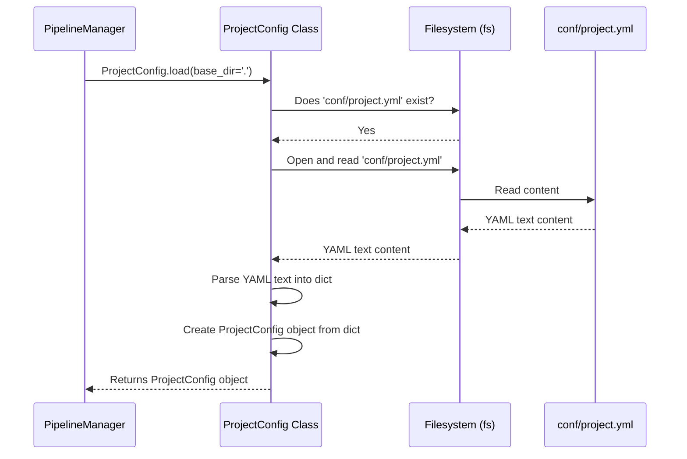

# Chapter 3: The Blueprints - Configuration (Config / ProjectConfig / PipelineConfig)

In [Chapter 2: The Project Manager - PipelineManager](02_pipelinemanager_.md), we saw how the `PipelineManager` acts as the central control panel for running, scheduling, and managing our pipelines. But how does the manager know *exactly* how to run a specific pipeline? Where does it get its instructions?

Imagine you're building a complex LEGO model. You have the manager (you), the librarian (the instructions booklet index listing all the sections), but you still need the detailed step-by-step instructions for each part of the model. That's where configuration comes in!

## What's the Problem?

Every project and every pipeline needs specific settings:

*   **Project-wide:** Maybe you want all background jobs to run using a specific system (like Redis or a database). Where do you set that *once* for the whole project?
*   **Pipeline-specific:**
    *   How often should the `daily_report` pipeline run?
    *   Does the `data_cleansing` pipeline need a specific input file path?
    *   Can we make the `image_processing` pipeline use more computer power (CPUs) because it's slow?
    *   Where should the results of the `user_analysis` pipeline be saved?

Hardcoding these settings directly into the pipeline's Python code is messy and inflexible. If you want to change the schedule or the output path, you'd have to dig into the code every time. We need a separate place to store these "instructions" or "blueprints".

## Meet the Instruction Manuals: `ProjectConfig` and `PipelineConfig`

`flowerpower` uses configuration files, typically written in a simple format called YAML, to store these settings. Think of them like instruction manuals or blueprints that guide how the project and individual pipelines should behave.

There are two main types of configuration manuals:

1.  **`ProjectConfig` (The Master Plan):**
    *   This holds settings that apply to the **entire project**.
    *   It usually lives in a file named `conf/project.yml`.
    *   Examples: What kind of system should manage background jobs (`job_queue.type`)? Are there project-wide credentials for accessing external services?
    *   Analogy: The overall rules and guidelines for the entire construction site (e.g., safety regulations, standard tools to use).

2.  **`PipelineConfig` (The Detailed Blueprint):**
    *   This holds settings **specific to one single pipeline**.
    *   Each pipeline gets its own configuration file, typically stored in `conf/pipelines/your_pipeline_name.yml`.
    *   Examples:
        *   Default input values (`run.inputs`).
        *   Which outputs to calculate (`run.final_vars`).
        *   How often to run the pipeline on a schedule (`schedule`).
        *   Specific parameters the pipeline code might need (`params`).
        *   Settings for specialized tools (Adapters) the pipeline uses (`adapter`).
        *   How much computing power to use (`run.executor`).
    *   Analogy: The detailed blueprint for building one specific part of the house, like the kitchen or the bathroom.

**Helper Classes:**

*   **`Config`:** A convenience class that can load *both* the `ProjectConfig` and a specific `PipelineConfig` together. Like having the master plan and the specific blueprint open side-by-side.
*   **`BaseConfig`:** A foundational building block (like the standard paper size and format for blueprints) that provides the common logic for loading configuration data from YAML files and saving it back. `ProjectConfig` and `PipelineConfig` are built using `BaseConfig`.

## How to Use Configuration (Solving the Use Case)

Let's say we want to configure our `daily_report` pipeline:

1.  **Specify the output filename:** We want the report saved as `daily_summary.csv` in the default output directory.
2.  **Increase processing power:** This pipeline is a bit slow, so let's allow it to use up to 4 processing threads (workers).
3.  **Set a project-wide job system:** We decide the whole project should use 'rq' (Redis Queue) for background jobs.

How do we do this? We edit the YAML files!

**1. Setting the Project-Wide Job Queue (`conf/project.yml`)**

```yaml
# File: conf/project.yml
name: flowerpower_project # Optional: A name for your project
job_queue:
  type: rq # Use Redis Queue for background jobs project-wide
  # backend: ... (other rq specific settings can go here)
adapter: {} # Placeholder for project-wide adapter settings
```

*Explanation:* We create/edit the `conf/project.yml` file. Inside the `job_queue` section, we set the `type` to `rq`. When the [PipelineManager](02_pipelinemanager_.md) needs to interact with the [JobQueueManager / PipelineJobQueue](08_jobqueuemanager___pipelinejobqueue_.md), it will read this setting and know which system to use.

**2. Setting Pipeline-Specific Details (`conf/pipelines/daily_report.yml`)**

```yaml
# File: conf/pipelines/daily_report.yml

run: # Settings related to running the pipeline
  inputs:
    # Define a default input value named 'output_filename'
    output_filename: "daily_summary.csv"
  final_vars:
    # Specify the main outputs we care about
    - report_path
    - record_count
  executor:
    # Configure the execution engine
    type: threadpool # Use multiple threads
    max_workers: 4    # Allow up to 4 threads
  # ... other run settings like cache, adapters ...

schedule: # Settings for scheduling
  enabled: false # This pipeline isn't scheduled by default
  # cron: "0 8 * * *" # Example: uncomment to run daily at 8 AM

params: # Custom parameters accessible within the pipeline code
  report_title: "Daily Activity Summary"
  threshold: 0.95

adapter: {} # Placeholder for pipeline-specific adapter settings
```

*Explanation:*
*   We create/edit `conf/pipelines/daily_report.yml`.
*   Under `run.inputs`, we define `output_filename` with our desired value. The pipeline code can then access this value.
*   Under `run.executor`, we set `type` to `threadpool` and `max_workers` to `4`. The [PipelineRunner](04_pipelinerunner_.md) will use this information to potentially speed up execution.
*   We also added some `params` which are like constants the pipeline code can use, and configured the `schedule` (currently disabled).

**How does FlowerPower use these?**

You don't usually write Python code to load these files yourself. Components like the [PipelineManager](02_pipelinemanager_.md) and [PipelineRunner](04_pipelinerunner_.md) automatically load the relevant configuration files when needed:

*   When `PipelineManager` starts, it loads `conf/project.yml` into a `ProjectConfig` object.
*   When you call `manager.run("daily_report")` or `manager.schedule("daily_report")`, the manager (or the runner/scheduler it uses) loads `conf/pipelines/daily_report.yml` into a `PipelineConfig` object.

These loaded configuration objects then guide the behavior of the components.

## Under the Hood: Loading the Blueprints

How does `flowerpower` read these YAML files and turn them into usable Python objects?

**The Process:**

1.  **Request:** A component (like `PipelineManager`) needs the configuration. It asks the configuration system (e.g., `ProjectConfig.load()` or `PipelineConfig.load()`).
2.  **Find File:** The configuration class determines the expected file path (e.g., `conf/project.yml` or `conf/pipelines/daily_report.yml`).
3.  **Read File:** It uses the [Filesystem Abstraction (fsspec wrappers/helpers)](05_filesystem_abstraction__fsspec_wrappers_helpers_.md) (`fs`) to open and read the content of the YAML file. This works whether the file is on your local disk, S3, GCS, etc.
4.  **Parse YAML:** It uses a library (like `msgspec` or `PyYAML`) to parse the text content of the file into a Python dictionary.
5.  **Create Object:** It takes the Python dictionary and uses it to create an instance of the corresponding configuration class (`ProjectConfig` or `PipelineConfig`). This makes the settings easily accessible via attributes (like `config.run.executor.max_workers`).

**Sequence Diagram:**



**Code Structure (Simplified):**

The configuration classes like `ProjectConfig` and `PipelineConfig` are defined using `msgspec.Struct` (a way to define structured data classes, similar to Python's dataclasses). This makes loading and accessing the data clean and efficient.

```python
# Simplified concept from src/flowerpower/cfg/base.py
import msgspec
from fsspec import AbstractFileSystem, filesystem

class BaseConfig(msgspec.Struct, kw_only=True):
    # ... (common methods like to_dict, merge) ...

    @classmethod
    def from_yaml(cls, path: str, fs: AbstractFileSystem | None = None) -> "BaseConfig":
        """Loads from YAML."""
        if fs is None:
            fs = filesystem("file") # Get filesystem access
        with fs.open(path) as f: # Use filesystem to open path
            # Use msgspec to decode YAML bytes into the class structure
            return msgspec.yaml.decode(f.read(), type=cls, strict=False)

    def to_yaml(self, path: str, fs: AbstractFileSystem | None = None) -> None:
        """Saves to YAML."""
        # ... (uses fs.open(path, 'wb') and msgspec.yaml.encode) ...
```

*Explanation:* The `BaseConfig` provides the core `from_yaml` method. It uses the provided filesystem (`fs`) to open the specified `path`, reads the content, and then `msgspec.yaml.decode` automatically maps the YAML structure to the fields defined in the specific config class (like `ProjectConfig` or `PipelineConfig`).

```python
# Simplified concept from src/flowerpower/cfg/project/__init__.py
from .job_queue import JobQueueConfig
from .adapter import AdapterConfig
from ..base import BaseConfig
import msgspec

class ProjectConfig(BaseConfig):
    name: str | None = msgspec.field(default=None)
    job_queue: JobQueueConfig = msgspec.field(default_factory=JobQueueConfig)
    adapter: AdapterConfig = msgspec.field(default_factory=AdapterConfig)

    @classmethod
    def load(cls, base_dir: str = ".", fs: AbstractFileSystem | None = None, **kwargs):
        # ... (logic to get filesystem if not provided) ...
        if fs.exists("conf/project.yml"):
            # Use the base class method to load from YAML
            project = cls.from_yaml(path="conf/project.yml", fs=fs)
        else:
            # Create a default one if file doesn't exist
            project = cls(name=kwargs.get("name"))
        # ... (apply overrides like job_queue_type) ...
        return project
```

*Explanation:* `ProjectConfig` defines its expected fields (`name`, `job_queue`, `adapter`). Its `load` method finds the `conf/project.yml` file and uses the `from_yaml` method (inherited from `BaseConfig`) to actually read and parse it into a `ProjectConfig` object. Nested structures like `job_queue` are automatically handled because `JobQueueConfig` is also a `BaseConfig`.

The `PipelineConfig` class (`src/flowerpower/cfg/pipeline/__init__.py`) works similarly, defining fields like `run`, `schedule`, `params`, `adapter`, and loading from `conf/pipelines/<name>.yml`.

## Conclusion

Configuration is the key to customizing how `flowerpower` works without changing the core code. You've learned about:

*   **`ProjectConfig` (`conf/project.yml`):** Settings for the whole project (e.g., job queue type).
*   **`PipelineConfig` (`conf/pipelines/*.yml`):** Settings for individual pipelines (e.g., inputs, schedule, parameters, execution resources).
*   **YAML:** The simple file format used for configuration.
*   How these configurations act as **blueprints** or **instruction manuals** guiding components like the `PipelineManager`.
*   How `BaseConfig` provides the foundation for loading/saving, and `Config` can bundle project and pipeline configs.

By editing these simple YAML files, you can control many aspects of your project and pipeline behavior.

In the next chapter, we'll meet the component that directly follows the `PipelineConfig` instructions to execute the actual work: [Chapter 4: PipelineRunner](04_pipelinerunner_.md).

---

Generated by [AI Codebase Knowledge Builder](https://github.com/The-Pocket/Tutorial-Codebase-Knowledge)