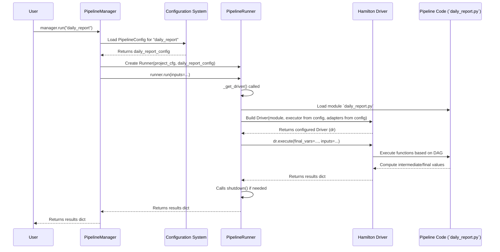

# Chapter 4: The Pipeline Chef - PipelineRunner

In [Chapter 3: The Blueprints - Configuration (Config / ProjectConfig / PipelineConfig)](03_configuration__config___projectconfig___pipelineconfig__.md), we learned how configuration files act as the detailed blueprints for both our project (`ProjectConfig`) and individual pipelines (`PipelineConfig`). These blueprints tell `flowerpower` *how* things should work.

But who actually reads a specific pipeline's blueprint (`PipelineConfig`) and does the work? If the [PipelineManager](02_pipelinemanager_.md) is the project manager who decides *which* blueprint to use, who is the skilled craftsperson or chef that follows the instructions for *that specific blueprint*?

## What's the Problem?

Imagine the `PipelineManager` decides it's time to run the `daily_report` pipeline. It has the `PipelineConfig` for `daily_report` ready. This config might say:

*   Use the data from `yesterdays_raw_data.csv`.
*   Calculate the `total_sales` and `average_order_value`.
*   Run the calculations using multiple threads to speed things up.
*   Show a progress bar while it's running.
*   Save the final report to `daily_summary.csv` (which we set up in Chapter 3!).

The `PipelineManager` doesn't execute these steps itself. It needs to hand off this specific task, along with its unique instructions, to an engine designed for executing a single pipeline run.

## Meet the Chef: `PipelineRunner`

The `PipelineRunner` is the engine within `flowerpower` responsible for executing **one specific run** of a pipeline. Think of it like a chef in a kitchen.

*   **Receives the Recipe:** The `PipelineManager` gives the `PipelineRunner` a specific recipe to execute – this is the `PipelineConfig` for the pipeline being run (e.g., `daily_report.yml`). It also gets the overall kitchen rules (`ProjectConfig`).
*   **Gathers Ingredients & Tools:** Based on the recipe (`PipelineConfig`), the `PipelineRunner`:
    *   Finds the pipeline's core logic (the Python code, e.g., `pipelines/daily_report.py`).
    *   Gets any specific input data needed (maybe passed in by the `PipelineManager` or defined in the config).
    *   Sets up the right "cooking" environment (e.g., should it run steps one by one, or use multiple "assistant chefs" - threads/processes - as specified in `run.executor`?).
    *   Integrates any special tools requested (e.g., a progress bar or a tracking system, based on `run.with_adapter` and `adapter` settings). These are covered in [Adapters (Hamilton Integration)](07_adapters__hamilton_integration_.md).
*   **Executes the Recipe:** The `PipelineRunner` uses a powerful underlying library called `Hamilton` to understand the steps in the pipeline code, figure out the dependencies (which calculations need to happen first), and then executes the data transformations.
*   **Serves the Dish:** Once all the steps are complete, the `PipelineRunner` produces the final results (the requested outputs, like `report_path` and `record_count` from our `daily_report` example) and gives them back to the `PipelineManager`.

Essentially, `PipelineRunner` takes a pipeline definition and its configuration and turns them into executed code and results for a single run.

## How the Manager Uses the Runner (Solving the Use Case)

You usually don't create or call `PipelineRunner` directly. The [PipelineManager](02_pipelinemanager_.md) handles this for you when you call `manager.run(...)`.

Let's revisit running our `daily_report`:

```python
from flowerpower.pipeline import PipelineManager

# Get the project manager
manager = PipelineManager()

# Ask the manager to run the 'daily_report'
print("Manager: Please run the daily_report pipeline.")
results = manager.run(name="daily_report") # <-- This triggers the PipelineRunner

print("Manager: The report is done!")
print("Results:", results)
```

*Explanation:*
1.  You tell the `manager` to run `daily_report`.
2.  **Inside `manager.run`:**
    *   The `manager` loads the `ProjectConfig` (if not already loaded).
    *   The `manager` loads the specific `PipelineConfig` for `daily_report` (using logic from [Chapter 3](03_configuration__config___projectconfig___pipelineconfig__.md)).
    *   **The `manager` creates a `PipelineRunner` instance, giving it the `ProjectConfig` and the `daily_report` `PipelineConfig`.**
    *   The `manager` tells this newly created `PipelineRunner` to execute, possibly passing along any overrides (like specific `inputs`).
3.  The `PipelineRunner` does its work (finds code, sets up environment using config, runs Hamilton, etc.).
4.  The `PipelineRunner` returns the final `results` dictionary to the `manager`.
5.  The `manager` gives the `results` back to you.

You interact with the `PipelineManager`, but the `PipelineRunner` is the component doing the actual execution work for that specific invocation, guided by the configuration.

## Under the Hood: The Chef at Work

Let's peek into the kitchen when `manager.run("daily_report")` happens and the `PipelineManager` delegates to the `PipelineRunner`.

**1. Initialization:**

The `PipelineManager` creates the `PipelineRunner` instance.

```python
# Simplified from src/flowerpower/pipeline/manager.py
class PipelineManager:
    # ... other methods ...
    def _get_run_func_for_job(self, name: str, reload: bool = False) -> Callable:
        # Load the specific blueprint for the pipeline
        pipeline_cfg = self._load_pipeline_cfg(name=name, reload=reload)

        # Create the 'Chef' (PipelineRunner) with the blueprints
        runner = PipelineRunner(
            project_cfg=self.project_cfg, # Overall project rules
            pipeline_cfg=pipeline_cfg     # Specific pipeline recipe
        )
        # Return the chef's 'cook' function
        return runner.run
```

*Explanation:* The `PipelineManager` loads the correct `PipelineConfig` (the recipe) and then creates a `PipelineRunner` (the chef), providing both the project's general rules (`ProjectConfig`) and the specific recipe (`PipelineConfig`). It gets back the `runner.run` method, which is the command to start cooking.

**2. The `run` Method Call:**

The `PipelineManager` calls the `run` method on the `PipelineRunner` instance it just created.

```python
# Simplified from src/flowerpower/pipeline/runner.py
class PipelineRunner:
    def __init__(self, project_cfg: ProjectConfig, pipeline_cfg: PipelineConfig):
        # Store the blueprints
        self.project_cfg = project_cfg
        self.pipeline_cfg = pipeline_cfg
        self.name = pipeline_cfg.name # Get the pipeline name
        # ... (disable telemetry/autoload if needed) ...

    def run(self, inputs: dict | None = None, final_vars: list[str] | None = None, ...) -> dict:
        # Start timing
        self.start_time = dt.datetime.now()
        logger.info(f"Starting pipeline {self.project_cfg.name}.{self.name}")

        # Determine final outputs (from config or overrides)
        final_vars = final_vars or self.pipeline_cfg.run.final_vars

        # Combine inputs (from config and overrides)
        inputs = {**(self.pipeline_cfg.run.inputs or {}), **(inputs or {})}

        # --- The Core Hamilton Setup ---
        # Get the Hamilton driver (the core execution engine)
        # This helper function reads config for executor, adapters etc.
        dr, shutdown = self._get_driver(config=config, cache=cache, ...)

        # --- Execute the Pipeline ---
        # Tell the Hamilton driver to run, calculating the final_vars
        res = dr.execute(final_vars=final_vars, inputs=inputs)

        # Stop timing and report success
        self.end_time = dt.datetime.now()
        # ... (log success message) ...

        # Clean up (e.g., shutdown parallel workers if needed)
        if shutdown:
            shutdown()

        return res # Return the results dictionary
```

*Explanation:*
1.  The `run` method receives any specific `inputs` or desired `final_vars` from the `PipelineManager`.
2.  It merges these with the defaults defined in the `PipelineConfig`.
3.  It calls a helper method `_get_driver` (more on this below) to set up the core Hamilton execution engine (`dr`). This is where the `PipelineConfig` heavily influences things like parallelism (`run.executor`) and adapters (`run.with_adapter`).
4.  It calls `dr.execute(...)`, telling Hamilton: "Run the pipeline defined in the code, calculate these `final_vars`, and use these `inputs`."
5.  Hamilton does its magic, executing the functions in the pipeline's Python module in the correct order.
6.  The results (`res`) are returned.
7.  Any necessary cleanup (like stopping parallel worker pools) is done via `shutdown()`.
8.  The final results dictionary is returned to the `PipelineManager`.

**3. Setting up the Hamilton Driver (`_get_driver`)**

This helper method is crucial. It reads the `PipelineConfig` and prepares the Hamilton `driver` object, which actually understands and executes the pipeline code.

```python
# Simplified from src/flowerpower/pipeline/runner.py
class PipelineRunner:
    # ... (init, run) ...

    def _get_executor(self, executor_cfg: ...):
        # Reads self.pipeline_cfg.run.executor (e.g., threadpool, max_workers)
        # Creates the appropriate Hamilton executor object
        logger.debug(f"Using executor: {executor_cfg.type}")
        if executor_cfg.type == "threadpool":
             return executors.MultiThreadingExecutor(...), None # Return executor and shutdown func
        # ... other executor types (processpool, ray, dask)...
        else:
             return executors.SynchronousLocalTaskExecutor(), None # Default: run sequentially

    def _get_adapters(self, with_adapter_cfg: ...):
        # Reads self.pipeline_cfg.run.with_adapter (e.g., tracker, progressbar)
        # Reads self.pipeline_cfg.adapter and self.project_cfg.adapter for details
        # Creates and returns a list of Hamilton adapter objects
        adapters = []
        if with_adapter_cfg.tracker:
            adapters.append(HamiltonTracker(...))
        if with_adapter_cfg.progressbar:
             adapters.append(h_rich.RichProgressBar(...))
        # ... other adapters (mlflow, opentelemetry, etc)...
        logger.debug(f"Adapters enabled: ...")
        return adapters

    def _get_driver(self, config: dict | None = None, ...) -> tuple[driver.Driver, Callable | None]:
         logger.debug("Setting up driver...")
         # 1. Load the pipeline's python code module
         module = load_module(name=self.name)

         # 2. Get the execution engine based on config
         executor, shutdown = self._get_executor(...)

         # 3. Get any active adapters based on config
         adapters = self._get_adapters(...)

         # 4. Get general config overrides
         config = config or self.pipeline_cfg.run.config

         # 5. Build the Hamilton Driver
         dr_builder = driver.Builder().with_modules(module).with_config(config)

         # Add executor if not the default synchronous one
         if executor:
             dr_builder = dr_builder.with_remote_executor(executor)

         # Add adapters if any are active
         if adapters:
             dr_builder = dr_builder.with_adapters(*adapters)

        # ... add caching if enabled ...

         # Finalize the driver
         dr = dr_builder.build()
         return dr, shutdown # Return the driver and any cleanup function
```

*Explanation:*
1.  It loads the actual Python code file for the pipeline (e.g., `pipelines/daily_report.py`).
2.  It calls `_get_executor` which looks at `pipeline_cfg.run.executor` to decide if the pipeline should run sequentially, or use threads, processes, Dask, or Ray for parallelism. It returns the appropriate Hamilton executor object.
3.  It calls `_get_adapters` which looks at `pipeline_cfg.run.with_adapter` and the `adapter` sections in both `PipelineConfig` and `ProjectConfig` to set up things like progress bars, MLFlow tracking, or OpenTelemetry tracing. It returns a list of Hamilton adapter objects. More details in [Adapters (Hamilton Integration)](07_adapters__hamilton_integration_.md).
4.  It uses Hamilton's `driver.Builder` to construct the final `driver` object, telling it about the pipeline code (`module`), any configuration overrides (`config`), the chosen execution engine (`executor`), and any active `adapters`.
5.  It returns the fully configured Hamilton `driver` and any necessary `shutdown` function (used to clean up resources like thread pools).

**Sequence Diagram: Manager running a Pipeline**



This flow shows how the `PipelineManager` delegates the execution to the `PipelineRunner`, which configures and uses the underlying Hamilton library to run the code defined in the specific pipeline module, all guided by the `PipelineConfig`.

## Conclusion

You've met the `PipelineRunner`, the "chef" that executes a single pipeline recipe (`PipelineConfig`). Key takeaways:

*   It's responsible for **one run** of a specific pipeline.
*   It's created and called by the [PipelineManager](02_pipelinemanager_.md).
*   It reads the `PipelineConfig` and `ProjectConfig` to set up the execution environment.
*   It configures things like **parallel execution** (`run.executor`) and **integrations** (`run.with_adapter`) based on the configuration blueprints.
*   It uses the **Hamilton library** (`driver`) under the hood to parse the pipeline code, determine the execution order (DAG), and run the functions.
*   It returns the final results of the pipeline run back to the `PipelineManager`.

Understanding the `PipelineRunner` helps clarify how `flowerpower` translates your configuration and pipeline code into actual execution and results.

In the next chapter, we'll explore a fundamental utility that many components, including the configuration loaders and potentially your pipelines, rely on: [Chapter 5: Filesystem Abstraction (fsspec wrappers/helpers)](05_filesystem_abstraction__fsspec_wrappers_helpers_.md). This allows `flowerpower` to work seamlessly with files whether they are on your local disk or in the cloud.

---

Generated by [AI Codebase Knowledge Builder](https://github.com/The-Pocket/Tutorial-Codebase-Knowledge)