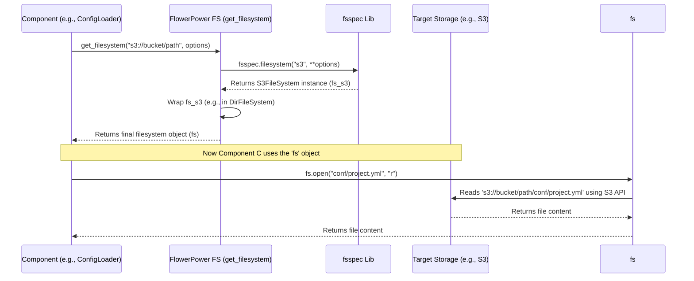

# Chapter 5: The Universal File Adapter - Filesystem Abstraction (fsspec wrappers/helpers)

In the [previous chapter](04_pipelinerunner_.md), we saw how the `PipelineRunner` acts like a chef, taking the recipe (`PipelineConfig`) and executing the steps of our pipeline. But pipelines often need to read input data (ingredients) and write output results (the finished dish). Where do these files come from? How does the runner know *how* to access them? They could be on your local computer, in cloud storage like Amazon S3 or Google Cloud Storage (GCS), or even inside a Git repository!

## What's the Problem?

Imagine your `daily_report` pipeline needs to read a CSV file. What if today the file is on your laptop (`C:\data\input.csv`), but tomorrow it needs to run using a file stored in the cloud (`s3://my-data-bucket/input.csv`)?

Writing separate code to handle each location would be painful:

*   Code for local files uses standard Python file opening.
*   Code for S3 needs the `boto3` library and AWS credentials.
*   Code for GCS needs the `google-cloud-storage` library and Google credentials.

If you had to write specific code for every possible file location inside every pipeline, your code would become very complicated and repetitive. How can we write code that just says "read this file" without worrying about *where* it is?

**Use Case:** How does the [Configuration](03_configuration__config___projectconfig___pipelineconfig__.md) system load the `conf/project.yml` file? If your project lives on your local disk, it's easy. But what if the whole project is stored in an S3 bucket? How does `flowerpower` read that same `conf/project.yml` file?

## Meet the Universal File Adapter: `fsspec` and FlowerPower Helpers

`flowerpower` solves this problem using a powerful library called `fsspec` (FileSystem Spec). `fsspec` provides a **standard way** to interact with various storage systems (local disk, S3, GCS, Azure, Git, HTTP, etc.) using a consistent interface.

Think of it like a universal travel adapter. You have one adapter (`fsspec` interface), and it lets you plug your device (your code) into different wall sockets (different storage systems) without needing a different plug for each country.

`flowerpower` builds on `fsspec` by providing some helpful wrappers and extensions:

1.  **`get_filesystem(path, storage_options)`:** This is the main entry point. You give it a path string (like `"s3://my-bucket/file.txt"` or `"/local/path/file.txt"`), and it intelligently figures out the storage type (S3, local, etc.) based on the prefix (like `s3://` or `file://` or just `/`). It then creates and returns the correct `fsspec` filesystem object configured to access that location. You might also provide `storage_options` (like credentials).

2.  **`StorageOptions` Classes:** These are helper classes (like `AwsStorageOptions`, `GcsStorageOptions`) that hold the specific settings needed for different cloud filesystems. For example, `AwsStorageOptions` might hold your AWS access key and secret key. They make it easier to manage credentials and configurations, and can often load settings automatically from environment variables.

3.  **`AbstractFileSystem` Extensions:** The filesystem objects (`fs`) returned by `get_filesystem` are based on `fsspec`'s `AbstractFileSystem`. `flowerpower` adds extra convenience methods directly to these `fs` objects for reading and writing common data formats like CSV, Parquet, and JSON directly, without needing extra libraries in your pipeline code. These extensions are heavily used by the [I/O Plugins](06_i_o_plugins__basefilereader_writer__loaders__savers__.md).

## How to Use the Adapter (Solving the Use Case)

Let's see how `flowerpower` uses this abstraction to load the `conf/project.yml` file, whether it's local or on S3. You typically won't call `get_filesystem` directly; components like the [Configuration](03_configuration__config___projectconfig___pipelineconfig__.md) loader or the [PipelineManager](02_pipelinemanager_.md) use it internally.

**Scenario 1: Project is on your Local Disk**

```python
from flowerpower.fs import get_filesystem

# Assume the project path is '/home/user/my_flowerpower_project'
project_path = "/home/user/my_flowerpower_project"
config_file_relative_path = "conf/project.yml"

# Get the filesystem object for the local path
# No special storage_options needed for local files
fs = get_filesystem(project_path)

# Construct the full path within the filesystem context
config_file_full_path = f"{fs.path}/{config_file_relative_path}"
# For local, fs.path is usually the same as project_path

# Use the standard 'open' method provided by the filesystem object
print(f"Attempting to open: {config_file_full_path}")
with fs.open(config_file_relative_path, mode='r') as f:
    content = f.read()
    print("Successfully read project.yml!")
    # Now components can parse the 'content' (usually YAML)
```

*Explanation:*
1.  `get_filesystem(project_path)` recognizes the path is local (no prefix like `s3://`) and returns a local filesystem object.
2.  We use the standard `fs.open()` method to open the `conf/project.yml` file relative to the filesystem's root (`project_path`).
3.  The file content is read successfully.

**Scenario 2: Project is on Amazon S3**

```python
from flowerpower.fs import get_filesystem, AwsStorageOptions

# Assume the project path is 's3://my-cool-project-bucket/'
project_path_s3 = "s3://my-cool-project-bucket/"
config_file_relative_path = "conf/project.yml" # Relative path remains the same

# Define storage options (e.g., credentials for S3)
# These could also be loaded from environment variables automatically!
s3_options = AwsStorageOptions(
    key="YOUR_AWS_ACCESS_KEY_ID", # Replace with your actual key
    secret="YOUR_AWS_SECRET_ACCESS_KEY" # Replace with your actual secret
)

# Get the filesystem object for the S3 path, providing options
fs_s3 = get_filesystem(project_path_s3, storage_options=s3_options)

# Use the SAME standard 'open' method!
print(f"Attempting to open: {project_path_s3}{config_file_relative_path}")
with fs_s3.open(config_file_relative_path, mode='r') as f:
    content = f.read()
    print("Successfully read project.yml from S3!")
    # Code to parse 'content' is exactly the same as the local version
```

*Explanation:*
1.  `get_filesystem(project_path_s3, storage_options=s3_options)` sees the `s3://` prefix. It uses this and the provided `s3_options` (credentials) to create an `S3FileSystem` object configured for your bucket.
2.  Crucially, the code to *open and read* the file (`fs_s3.open(...)`) is **identical** to the local version. The code doesn't need to know it's talking to S3; the `fs_s3` object handles the S3-specific communication internally.

This is the power of filesystem abstraction: your core logic for interacting with files remains the same, regardless of the storage backend.

## Under the Hood: How the Adapter Works

Let's trace the steps when a component asks for a filesystem object using `get_filesystem`.

**Walkthrough:**

Imagine the [PipelineManager](02_pipelinemanager_.md) needs to access the project, which lives at `s3://my-cool-project-bucket/`.

1.  **Call `get_filesystem`:** The manager calls `get_filesystem("s3://my-cool-project-bucket/", storage_options=...)`.
2.  **Infer Protocol:** `get_filesystem` looks at the path `"s3://my-cool-project-bucket/"` and extracts the protocol: `"s3"`.
3.  **Call `fsspec`:** It uses the core `fsspec.filesystem()` function, passing the protocol `"s3"` and the provided `storage_options` (containing AWS credentials).
4.  **Create Specific Filesystem:** `fsspec` uses the protocol name to find and create the correct filesystem implementation (in this case, `s3fs.S3FileSystem`), passing the credentials to it.
5.  **Optional Wrapping (DirFileSystem):** `flowerpower` often wraps the created filesystem (e.g., `S3FileSystem`) inside a `DirFileSystem`. This makes the specific path (`s3://my-cool-project-bucket/`) act like the root directory (`/`), so you can refer to files within it using relative paths (like `conf/project.yml`).
6.  **Optional Wrapping (Caching):** If `cached=True` was passed, the filesystem might be further wrapped in a `SimpleCacheFileSystem` which automatically downloads remote files to a local cache directory for faster subsequent access.
7.  **Return Filesystem Object:** The final filesystem object (`fs`), possibly wrapped, is returned to the caller (the `PipelineManager`). This `fs` object now has methods like `.open()`, `.ls()`, `.read_*()`, `.write_*()` that work consistently.

**Sequence Diagram:**



**Code Snippets (Simplified):**

*   **`get_filesystem` (from `src/flowerpower/fs/base.py`)**:

```python
# Simplified from src/flowerpower/fs/base.py
from fsspec import filesystem
from fsspec.implementations.dirfs import DirFileSystem
from .storage_options import BaseStorageOptions # and AwsStorageOptions etc.
from .storage_options import from_dict as storage_options_from_dict

def get_filesystem(
    path: str | None = None,
    storage_options: BaseStorageOptions | dict | None = None,
    dirfs: bool = True, # Often True to set a root path
    cached: bool = False,
    fs: AbstractFileSystem | None = None, # Can pass an existing one
    **storage_options_kwargs
) -> AbstractFileSystem:

    if fs is not None:
        # Logic to wrap an existing fs if needed (caching, dirfs)
        # ... simplified ...
        return fs # Return the potentially wrapped existing fs

    # Infer protocol (e.g., 's3', 'file', 'gcs') from the path string
    from fsspec.utils import infer_storage_options
    path_properties = infer_storage_options(str(path))
    protocol = path_properties.get("protocol", "file") # Default to local file
    actual_path = path_properties.get("path", "") # The path part after protocol

    # Prepare storage_options dictionary
    if isinstance(storage_options, BaseStorageOptions):
        opts_dict = storage_options.to_dict(with_protocol=False)
    elif isinstance(storage_options, dict):
        opts_dict = storage_options
    else:
        opts_dict = storage_options_kwargs # Use keyword args if provided

    # Core fsspec call to get the base filesystem
    base_fs = filesystem(protocol, **opts_dict)
    base_fs.is_cache_fs = False # Mark if it's cached

    # Optionally wrap in DirFileSystem to treat 'actual_path' as root
    if dirfs and actual_path:
        final_fs = DirFileSystem(path=actual_path, fs=base_fs)
        final_fs.is_cache_fs = False
    else:
        final_fs = base_fs

    # Optionally wrap in Caching Filesystem
    if cached:
        from .base import MonitoredSimpleCacheFileSystem # FlowerPower's caching FS
        cache_storage = path # Default cache location (can be configured)
        final_fs = MonitoredSimpleCacheFileSystem(fs=final_fs, cache_storage=cache_storage)
        final_fs.is_cache_fs = True

    return final_fs
```

*Explanation:* This function handles the logic of figuring out the `protocol`, preparing the `storage_options`, calling the main `fsspec.filesystem()` function, and then potentially wrapping the result in `DirFileSystem` (to set a root path) or `MonitoredSimpleCacheFileSystem` (for caching).

*   **`StorageOptions` Example (from `src/flowerpower/fs/storage_options.py`)**:

```python
# Simplified from src/flowerpower/fs/storage_options.py
from pydantic import BaseModel

class BaseStorageOptions(BaseModel):
    protocol: str
    # ... common methods like to_dict, from_yaml ...

class AwsStorageOptions(BaseStorageOptions):
    protocol: str = "s3" # Default protocol for this class
    key: str | None = None # Alias for access_key_id
    access_key_id: str | None = None
    secret: str | None = None # Alias for secret_access_key
    secret_access_key: str | None = None
    # ... other options like region, endpoint_url, token ...

    def model_post_init(self, __context: Any) -> None:
        # Handle aliases (if key is given, set access_key_id)
        if self.access_key_id is None and self.key is not None:
            self.access_key_id = self.key
        # ... handle other aliases ...

    @classmethod
    def from_env(cls) -> "AwsStorageOptions":
        # Logic to read AWS_ACCESS_KEY_ID etc. from environment variables
        # ... os.getenv(...) ...
        pass

    def to_fsspec_kwargs(self) -> dict:
        # Creates the dict expected by fsspec's S3FileSystem
        fsspec_kwargs = {
            "key": self.access_key_id,
            "secret": self.secret_access_key,
            # ... map other options ...
        }
        return {k: v for k, v in fsspec_kwargs.items() if v is not None}

# Similar classes exist for GcsStorageOptions, AzureStorageOptions etc.
```

*Explanation:* These classes (using Pydantic) define the expected settings for each storage type. They include helpful methods like loading from environment variables (`from_env`) and converting to the dictionary format needed by `fsspec` (`to_fsspec_kwargs`).

*   **Filesystem Extensions (from `src/flowerpower/fs/ext.py`)**:

```python
# File: src/flowerpower/fs/ext.py

# ... imports: orjson, polars, pyarrow, etc. ...
# from fsspec import AbstractFileSystem # Base class

def read_json(self: AbstractFileSystem, path: str | list[str], **kwargs):
    # ... implementation using self.open() and orjson ...
    pass

def read_csv(self: AbstractFileSystem, path: str | list[str], **kwargs):
    # ... implementation using self.open() and polars.read_csv ...
    pass

def read_parquet(self: AbstractFileSystem, path: str | list[str], **kwargs):
    # ... implementation using pyarrow.parquet.read_table(..., filesystem=self) ...
    pass

def write_json(self: AbstractFileSystem, data, path: str, **kwargs):
    # ... implementation using self.open() and orjson.dumps ...
    pass

# ... and many more helpers for reading/writing formats, datasets etc.

# --- Magic happens below ---
# These lines add the functions defined above as methods
# to the base fsspec AbstractFileSystem class, so any
# filesystem object created by get_filesystem will have them.
AbstractFileSystem.read_json = read_json
AbstractFileSystem.read_csv = read_csv
AbstractFileSystem.read_parquet = read_parquet
AbstractFileSystem.write_json = write_json
# ... add other methods ...
```

*Explanation:* This file defines many helper functions (like `read_json`, `write_parquet`) that take `self` (a filesystem object) as the first argument. Then, it *attaches* these functions directly to the `AbstractFileSystem` class. This means any filesystem object you get from `get_filesystem` will automatically have these handy methods available (e.g., `fs.read_parquet(...)`). How these are used for efficient I/O is the topic of the next chapter!

## Conclusion

You've learned about `flowerpower`'s Filesystem Abstraction layer, built on the powerful `fsspec` library. This is like a universal adapter that allows the project to work with files consistently, no matter where they are stored.

Key takeaways:

*   **Problem Solved:** Avoids writing storage-specific code everywhere.
*   **`fsspec`:** The underlying library providing the standard interface.
*   **`get_filesystem()`:** The main function to get the right filesystem object based on a path.
*   **`StorageOptions`:** Classes to manage configuration and credentials for cloud storage.
*   **Consistency:** Code using the `fs` object (like `fs.open()`) works the same for local files, S3, GCS, etc.
*   **Convenience:** `fs` objects have extra methods (like `fs.read_parquet`) added by `flowerpower` for common tasks.

This abstraction is fundamental to how `flowerpower` handles configuration, data loading, and saving results in a location-independent way.

In the next chapter, we'll see how these filesystem tools and extensions are used to build reusable [I/O Plugins (BaseFileReader/Writer, Loaders, Savers)](06_i_o_plugins__basefilereader_writer__loaders__savers__.md) for reading and writing various data formats efficiently within your pipelines.

---

Generated by [AI Codebase Knowledge Builder](https://github.com/The-Pocket/Tutorial-Codebase-Knowledge)