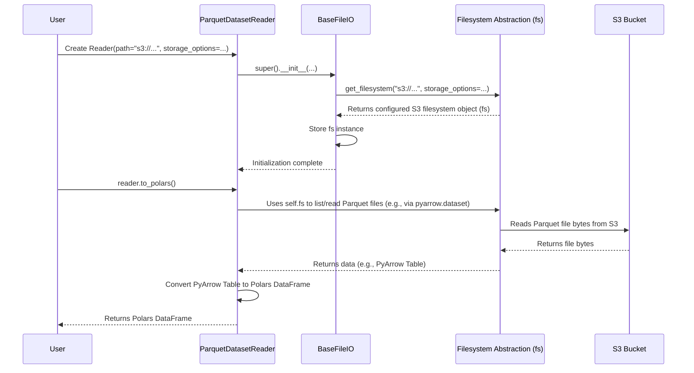

# Chapter 6: Handling Data - I/O Plugins (BaseFileReader/Writer, Loaders, Savers)

In the [previous chapter](05_filesystem_abstraction__fsspec_wrappers_helpers_.md), we learned about the Filesystem Abstraction, our universal adapter that lets `flowerpower` talk to files whether they're on your computer or in the cloud (like S3 or GCS). This is great for *locating* files, but how do we actually *read* the data inside them, especially when they come in different formats like CSV, Parquet, or JSON? And how do we save our results back out?

## What's the Problem?

Data pipelines constantly need to read data from somewhere and write results somewhere else. The challenge is that data comes in many shapes and sizes:

*   Simple text files like CSV.
*   Efficient column-based formats like Parquet.
*   Nested data structures like JSON.
*   Tables stored in databases like PostgreSQL or SQLite.

Writing code to handle each of these formats *and* each possible storage location (local, S3, GCS) inside every pipeline would be very repetitive and make our pipeline code complex.

**Use Case:** Imagine a pipeline that needs to:
1.  Read customer data stored as a Parquet dataset in an S3 bucket.
2.  Process this data using the Polars library (a fast data manipulation tool).
3.  Save the final summary report as a CSV file on your local computer.

How can we do this cleanly without cluttering our pipeline logic with S3 connection details or the specifics of how to parse Parquet vs. write CSV?

## Meet the Data Specialists: I/O Plugins

`flowerpower` uses a system of **I/O Plugins** to handle these tasks. Think of them as specialized tools in your data toolkit:

*   **Loaders:** Tools designed to *read* data from a specific source (like a Parquet file, a CSV dataset, or a PostgreSQL table) and load it into a format your code can use (like a Pandas DataFrame, a Polars DataFrame, or a PyArrow Table).
*   **Savers:** Tools designed to *write* data from your code (like a Polars DataFrame) to a specific destination in a particular format (like a CSV file or a database table).

These plugins build directly on the [Filesystem Abstraction](05_filesystem_abstraction__fsspec_wrappers_helpers_.md) to access the data wherever it lives.

## The Blueprint: `BaseFileReader` and `BaseFileWriter`

To make these plugins consistent, `flowerpower` provides base "blueprint" classes:

*   **`BaseFileReader`:** Defines the *standard way* to read data *from files*. Any file reader plugin (like `ParquetFileReader` or `CSVFileReader`) follows this blueprint. It expects information like the `path` to the file(s) and the `storage_options` (using the [Filesystem Abstraction](05_filesystem_abstraction__fsspec_wrappers_helpers_.md)). It provides common methods like:
    *   `.to_polars()`: Load data into a Polars DataFrame.
    *   `.to_pandas()`: Load data into a Pandas DataFrame.
    *   `.to_pyarrow_table()`: Load data into a PyArrow Table.
*   **`BaseFileWriter`:** Defines the *standard way* to write data *to files*. Any file writer plugin (like `ParquetFileWriter` or `CSVFileWriter`) follows this blueprint. It also uses `path` and `storage_options`. It provides a common method:
    *   `.write(data, ...)`: Saves the provided data (e.g., a Polars DataFrame) to the specified location and format.

There are also similar base classes for handling datasets (collections of files, often partitioned) like `BaseDatasetReader`/`Writer` and for databases like `BaseDatabaseReader`/`Writer`.

These base classes ensure that no matter the specific format, you interact with Loaders and Savers in a predictable way. They handle the setup of the [Filesystem Abstraction](05_filesystem_abstraction__fsspec_wrappers_helpers_.md) for you.

## The Specialists: `Loaders` and `Savers`

While the base classes define *what* methods are available, the specific Loader and Saver classes implement *how* to read/write for a particular format or database.

*   **Examples of Loaders:**
    *   `ParquetFileReader` / `ParquetDatasetReader`: Knows how to read Parquet files/datasets using libraries like PyArrow.
    *   `CSVFileReader` / `CSVDatasetReader`: Knows how to read CSV files/datasets using libraries like Polars.
    *   `JsonFileReader`: Knows how to read JSON files.
    *   `PostgreSQLReader`: Knows how to connect to PostgreSQL and read data from a table or query.
    *   `SQLiteReader`: Knows how to read from an SQLite database file.
*   **Examples of Savers:**
    *   `ParquetFileWriter` / `ParquetDatasetWriter`: Knows how to write dataframes to Parquet files/datasets.
    *   `CSVFileWriter`: Knows how to write dataframes to CSV files.
    *   `PostgreSQLWriter`: Knows how to write dataframes to a PostgreSQL table.
    *   `SQLiteWriter`: Knows how to write to an SQLite database file.

You choose the specific Loader or Saver based on the data format and source/destination you need to interact with.

## How to Use Plugins (Solving the Use Case)

Let's solve our use case: read Parquet from S3 into Polars, then write the result as CSV locally.

**1. Reading Parquet from S3 (using a Loader)**

We need a Loader that understands Parquet datasets and can talk to S3. `ParquetDatasetReader` is the right tool.

```python
from flowerpower.plugins.io.loader import ParquetDatasetReader
from flowerpower.fs.storage_options import AwsStorageOptions

# Define where the data is and how to access S3
s3_path = "s3://my-customer-data-bucket/processed_parquet/"
aws_creds = AwsStorageOptions.create(profile="my_aws_profile") # Or keys directly

# Create the Loader instance
parquet_loader = ParquetDatasetReader(
    path=s3_path,
    storage_options=aws_creds
)

# Load the data into a Polars DataFrame (LazyFrame by default)
print("Loading Parquet data from S3...")
polars_df = parquet_loader.to_polars(lazy=False) # Get eager DataFrame
print(f"Loaded DataFrame with shape: {polars_df.shape}")

# Now you can work with polars_df in your pipeline...
# processed_df = a_pipeline_step(polars_df)
```

*Explanation:*
1.  We import the specific Loader (`ParquetDatasetReader`) and the helper for S3 credentials (`AwsStorageOptions`).
2.  We create an instance of `ParquetDatasetReader`, telling it the `path` on S3 and providing the `storage_options` necessary to connect. Behind the scenes, it uses the [Filesystem Abstraction](05_filesystem_abstraction__fsspec_wrappers_helpers_.md) to set up the S3 connection.
3.  We simply call `.to_polars(lazy=False)` on the loader instance. The loader handles finding the Parquet files in S3, reading them efficiently, and converting them into a single Polars DataFrame.
4.  The resulting `polars_df` is ready for use in the next steps of your pipeline.

*Example Output:*
```
Loading Parquet data from S3...
Loaded DataFrame with shape: (150000, 15)
```

**2. Writing CSV Locally (using a Saver)**

After processing, let's say `processed_df` is our final Polars DataFrame result. We want to save it as a CSV file locally. We need a Saver that can write CSV files to the local disk. `CSVFileWriter` fits the bill.

```python
from flowerpower.plugins.io.saver import CSVFileWriter
import polars as pl # Assuming processed_df is a Polars DataFrame

# Assume processed_df is the result from pipeline steps
# e.g., processed_df = pl.DataFrame({"colA": [1, 2], "colB": ["x", "y"]})

# Define where to save the CSV locally
local_output_path = "/path/on/my/computer/reports/summary.csv"

# Create the Saver instance
csv_saver = CSVFileWriter(
    path=local_output_path,
    # No storage_options needed for local files by default
)

# Write the DataFrame to the CSV file
print(f"Saving CSV report to: {local_output_path}")
save_metadata = csv_saver.write(data=processed_df)
print("Report saved successfully!")
print("Save metadata:", save_metadata)
```

*Explanation:*
1.  We import the specific Saver (`CSVFileWriter`).
2.  We create an instance of `CSVFileWriter`, giving it the local `path` where we want to save the file. Since it's a local path, we usually don't need `storage_options`. The Saver uses the [Filesystem Abstraction](05_filesystem_abstraction__fsspec_wrappers_helpers_.md) which defaults to the local filesystem.
3.  We call the `.write()` method on the saver, passing our `processed_df` (the Polars DataFrame) as the `data` argument.
4.  The `CSVFileWriter` handles converting the DataFrame to CSV format and writing it to the specified file `/path/on/my/computer/reports/summary.csv`.
5.  The `.write()` method often returns metadata about the save operation.

*Example Output:*
```
Saving CSV report to: /path/on/my/computer/reports/summary.csv
Report saved successfully!
Save metadata: {'path': '/path/on/my/computer/reports/summary.csv', 'format': 'csv', 'num_rows': 2, ...}
```

Notice how our pipeline code just creates the appropriate Loader/Saver and calls standard methods (`.to_polars()`, `.write()`). It doesn't need to know the internals of Parquet parsing or S3 connections.

## Under the Hood

How do these Loaders and Savers actually work? They combine the **Filesystem Abstraction** with **data processing libraries**.

**Walkthrough: `ParquetDatasetReader.to_polars()`**

1.  **Initialization:** When you create `ParquetDatasetReader(path="s3://...", storage_options=...)`:
    *   The base class (`BaseDatasetReader`, which inherits from `BaseFileIO`) gets called.
    *   It uses the `path` and `storage_options` to call `get_filesystem` from the [Filesystem Abstraction](05_filesystem_abstraction__fsspec_wrappers_helpers_.md).
    *   It receives an S3 filesystem object (`fs`) configured for your bucket and stores it as `self.fs`.
    *   It stores the format (`self.format = "parquet"`) and the path relative to the S3 bucket root.
2.  **`.to_polars()` Call:** When you call `parquet_loader.to_polars()`:
    *   The loader decides how to read based on its type (DatasetReader). It might use `self.fs.pyarrow_dataset(...)` or similar helpers from the [Filesystem Abstraction](05_filesystem_abstraction__fsspec_wrappers_helpers_.md) extensions.
    *   These helpers use the `self.fs` object (the S3 filesystem) and libraries like `pyarrow.dataset` library to efficiently scan the S3 path, discover Parquet files (respecting partitioning if configured), and read the data.
    *   The data is typically first loaded as a PyArrow Table or Dataset.
    *   Finally, the method converts the PyArrow data into a Polars DataFrame (e.g., using `polars.from_arrow()`) and returns it.

**Sequence Diagram (Simplified Read)**



**Code Structure (Simplified)**

*   **Base Class (`src/flowerpower/plugins/io/base.py`)**

```python
# Simplified from src/flowerpower/plugins/io/base.py
from pydantic import BaseModel
from fsspec import AbstractFileSystem
from ...fs import get_filesystem # Our Filesystem Abstraction helper

class BaseFileIO(BaseModel):
    model_config = ConfigDict(arbitrary_types_allowed=True)
    path: str | list[str]
    storage_options: (...) | None = None
    fs: AbstractFileSystem | None = None
    format: str | None = None

    def model_post_init(self, __context):
        # ... (logic to handle storage_options dictionary/object) ...
        if self.fs is None:
            # Uses the Filesystem Abstraction to get the right fs object!
            self.fs = get_filesystem(
                path=self.path if isinstance(self.path, str) else self.path[0],
                storage_options=self.storage_options,
                fs=self.fs,
                dirfs=True, # Treat the path as root directory
            )
        # ... (logic to clean up self.path relative to fs root) ...

class BaseFileReader(BaseFileIO):
    # Defines common reader arguments
    include_file_path: bool = False
    concat: bool = True
    # ... other common options

    def _load(self, reload: bool = False, **kwargs):
        # Central place to load data using self.fs and self.format
        # Often uses helper methods attached to self.fs like self.fs.read_files(...)
        # self._data = self.fs.read_files(path=self._glob_path, format=self.format, ...)
        pass # Simplified

    def to_polars(self, lazy: bool = False, metadata: bool = False, **kwargs):
        self._load(**kwargs) # Ensure data is loaded
        # Convert self._data (often PyArrow) to Polars
        # df = pl.from_arrow(self._data) # Simplified conversion
        # return df (potentially with metadata)
        pass # Simplified

    # Similar methods for to_pandas(), to_pyarrow_table(), iter_polars() etc.

class BaseFileWriter(BaseFileIO):
    # Defines common writer arguments
    basename: str | None = None
    mode: str = "append" # append, overwrite, etc.
    # ... other common options

    def write(self, data, **kwargs) -> dict:
        # Central place to write data using self.fs and self.format
        # Often uses helpers like self.fs.write_files(...)
        # metadata = get_dataframe_metadata(data, ...)
        # self.fs.write_files(data=data, path=self._path, format=self.format, mode=self.mode, ...)
        # return metadata
        pass # Simplified
```

*Explanation:*
*   `BaseFileIO` handles getting the correct filesystem (`self.fs`) using the [Filesystem Abstraction](05_filesystem_abstraction__fsspec_wrappers_helpers_.md).
*   `BaseFileReader` adds methods like `to_polars` which first ensure data is loaded (via `_load`, which uses `self.fs`) and then performs the conversion.
*   `BaseFileWriter` adds the `write` method which uses `self.fs` to perform the write operation.

*   **Specific Loader (`src/flowerpower/plugins/io/loader/parquet.py`)**

```python
# Simplified from src/flowerpower/plugins/io/loader/parquet.py
from ..base import BaseDatasetReader # Use Dataset reader for Parquet datasets

class ParquetDatasetReader(BaseDatasetReader):
    """Parquet dataset loader."""
    format: str = "parquet" # <-- Tells the base class which format we handle

    def model_post_init(self, __context):
        # The parent class handles setting up the filesystem (self.fs)
        super().model_post_init(__context)
        # No parquet-specific init needed here for this example

    # Inherits to_polars, to_pandas etc. from BaseDatasetReader
    # The _load method in the base class uses self.format="parquet"
    # when calling self.fs.read_files or self.fs.pyarrow_dataset
```

*Explanation:* The specific loader (`ParquetDatasetReader`) inherits from the appropriate base class (`BaseDatasetReader`). It mainly just sets `self.format = "parquet"`. The base class's methods (`_load`, `to_polars`, etc.) will use this format information when interacting with the filesystem (`self.fs`) helpers.

*   **Specific Saver (`src/flowerpower/plugins/io/saver/csv.py`)**

```python
# Simplified from src/flowerpower/plugins/io/saver/csv.py
from ..base import BaseFileWriter

class CSVFileWriter(BaseFileWriter):
    """CSV file writer."""
    format: str = "csv" # <-- Tells the base class which format we handle

    def model_post_init(self, __context):
        super().model_post_init(__context)
        # No csv-specific init needed here

    # Inherits the write method from BaseFileWriter.
    # The write method in the base class uses self.format="csv"
    # when calling self.fs.write_files
```

*Explanation:* Similar to the Loader, the `CSVFileWriter` inherits from `BaseFileWriter` and sets `self.format = "csv"`. The inherited `write` method uses this format when saving the data via the filesystem helpers.

## Conclusion

You've learned about `flowerpower`'s I/O Plugins, the specialized tools for reading (Loaders) and writing (Savers) data in various formats and locations.

Key takeaways:

*   **Problem Solved:** Provides a consistent way to handle diverse data formats (CSV, Parquet, JSON, databases) without repeating code in pipelines.
*   **Structure:** Built upon base classes (`BaseFileReader`/`Writer`, etc.) that define a standard interface, and specific classes (`ParquetFileReader`, `CSVFileWriter`, `PostgreSQLReader`, etc.) that implement the details for each technology.
*   **Leverages Abstraction:** Relies heavily on the [Filesystem Abstraction](05_filesystem_abstraction__fsspec_wrappers_helpers_.md) for location-independent data access.
*   **Consistency:** Loaders offer standard methods like `.to_polars()`, `.to_pandas()`, and Savers offer `.write()`.
*   **Flexibility:** Easily load data into different compute frameworks (Polars, Pandas, PyArrow) or save results consistently.

These I/O Plugins make your pipeline code cleaner by separating the *logic* of your pipeline from the *mechanics* of reading and writing data.

In the next chapter, we'll see how these Loaders and Savers are seamlessly integrated into the steps (nodes) of your data pipelines using [Adapters (Hamilton Integration)](07_adapters__hamilton_integration_.md).

---

Generated by [AI Codebase Knowledge Builder](https://github.com/The-Pocket/Tutorial-Codebase-Knowledge)