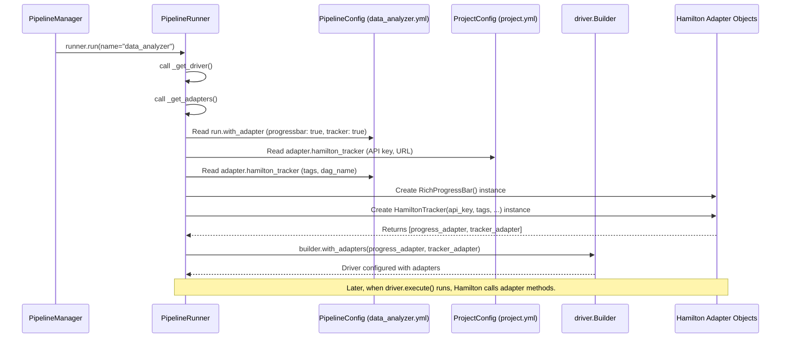

# Chapter 7: Optional Upgrades - Adapters (Hamilton Integration)

In the [previous chapter](06_i_o_plugins__basefilereader_writer__loaders__savers_.md), we learned about I/O Plugins (Loaders and Savers) that help our pipelines read and write data in various formats and locations. Now that our pipelines can handle data, what if we want to add extra features *while* they run? Maybe we want to see how long each step takes, track experiments, or even run parts of the pipeline faster on multiple computers.

## What's the Problem?

Imagine your pipeline is running, but it takes a long time. You're left wondering:
*   Is it stuck? How far along is it? A progress bar would be nice!
*   What were the exact inputs and outputs of this run? I want to track this experiment.
*   This pipeline is doing heavy calculations. Can I make it use more computer power without rewriting the whole thing?

Adding code for progress bars, tracking systems (like MLflow or the Hamilton UI), or distributed computing directly into your pipeline's main logic (the Python functions that do the work) makes the code messy and complicated. Your data processing functions should focus on processing data, not on displaying progress bars or talking to external tracking services.

**Use Case:** Let's say we have a simple pipeline named `data_analyzer`. We want to run it and:
1.  See a progress bar in our terminal while it runs.
2.  Track the run's details (inputs, outputs, execution) using the Hamilton UI service, so we can view it later in a web browser.

How can we add these features easily, without modifying the `data_analyzer.py` code itself?

## Meet the Upgrade Kits: Adapters

`flowerpower` uses **Adapters** to solve this. Think of Adapters like optional upgrade kits or accessories for your pipeline runs.

*   **Pluggable:** They are components you can easily add or remove.
*   **Enhance Execution:** They add features *during* the pipeline run, managed by the [PipelineRunner](04_pipelinerunner_.md).
*   **Hamilton Integration:** They specifically integrate with the underlying Hamilton library's adapter system. Hamilton is the engine that runs the core logic of your pipeline (as we saw in the [PipelineRunner](04_pipelinerunner_.md) chapter).
*   **Configuration Driven:** You typically enable and configure adapters through your project's or pipeline's [Configuration](03_configuration__config___projectconfig___pipelineconfig__.md) files (`project.yml` or `conf/pipelines/your_pipeline.yml`), not by changing your pipeline code.

**Common Adapter Types:**

*   **Progress Bars:** Show visual progress during execution (e.g., using `rich`).
*   **Run Tracking:** Log run details, inputs, outputs, parameters, and results to external systems like MLflow or the Hamilton UI service.
*   **Distributed Computing:** Enable running parts of your pipeline across multiple machines or cores using frameworks like Ray or Dask.
*   **Observability:** Send detailed performance metrics and traces to systems like OpenTelemetry for monitoring.

Adapters provide these powerful features as optional add-ons, keeping your main pipeline logic clean and focused.

## How to Use Adapters (Solving the Use Case)

Let's add a progress bar and Hamilton UI tracking to our `data_analyzer` pipeline. We only need to modify configuration files!

**1. Configure the Project (`conf/project.yml`)**

We need to tell `flowerpower` how to connect to the Hamilton UI service.

```yaml
# File: conf/project.yml
name: my_flowerpower_project

# Project-wide Adapter Settings
adapter:
  hamilton_tracker:
    # Your username for the UI service
    username: "your_hamilton_ui_username"
    # Your API key for the UI service
    api_key: "your_hamilton_ui_api_key"
    # URL of the Hamilton API service
    api_url: "https://api.app.hamilton.dagworks.io"
    # URL of the Hamilton UI website
    ui_url: "https://app.hamilton.dagworks.io"
    # Optional: Set a project ID if you have one from the UI
    # project_id: 123

# ... other project settings like job_queue ...
```

*Explanation:*
*   Under the `adapter` section, we configure `hamilton_tracker`.
*   We provide our credentials (`username`, `api_key`) and the service URLs. The [PipelineRunner](04_pipelinerunner_.md) will use these settings when the tracker adapter is activated.
*   *Note:* You first need to sign up for the Hamilton UI service (often free for individual use) to get these credentials.

**2. Configure the Pipeline (`conf/pipelines/data_analyzer.yml`)**

Now, we tell the `data_analyzer` pipeline specifically to *use* the progress bar and the tracker.

```yaml
# File: conf/pipelines/data_analyzer.yml

run: # Settings related to running the pipeline
  with_adapter:
    # Explicitly enable the progress bar
    progressbar: true
    # Explicitly enable the Hamilton tracker
    tracker: true
    # We can disable others if needed (defaults are often false)
    mlflow: false
    opentelemetry: false
    ray: false
    # ... other `with_adapter` options ...

  # We also might want to provide a name for the run in the UI
  final_vars:
    - result_summary
  # ... other run settings like inputs, executor ...

adapter: # Pipeline-specific adapter settings (optional overrides)
  hamilton_tracker:
    # Tag this specific run with pipeline context
    tags:
      pipeline: data_analyzer
      environment: development
    # Name for this specific DAG run within the project
    dag_name: "Daily Data Analysis Run"

# ... other pipeline settings like schedule, params ...
```

*Explanation:*
*   Inside the `run` section, we focus on `with_adapter`. We set `progressbar: true` and `tracker: true`. This tells the [PipelineRunner](04_pipelinerunner_.md) to activate these specific adapters for this pipeline.
*   Inside the `adapter.hamilton_tracker` section (optional), we can add specific tags for this pipeline's runs and give the run a custom name (`dag_name`) that will appear in the Hamilton UI.

**3. Run the Pipeline**

Now, we run the pipeline as usual using the [PipelineManager](02_pipelinemanager_.md). **No changes are needed in `pipelines/data_analyzer.py`!**

```python
from flowerpower.pipeline import PipelineManager

manager = PipelineManager()

print("Running data_analyzer with adapters...")
results = manager.run(name="data_analyzer")
print("Run complete!")
print("Results:", results)

```

*Explanation:* We just call `manager.run()`. Because we configured the adapters in the YAML files, the [PipelineRunner](04_pipelinerunner_.md) (which the manager uses) will automatically activate them.

**Expected Outcome:**

*   **In your terminal:** You will see a progress bar updating as the pipeline executes its steps.
*   **In your web browser:** If you log in to the Hamilton UI (`https://app.hamilton.dagworks.io`), you will find a new run tracked for your project, named "Daily Data Analysis Run", showing the execution graph, timings, inputs, outputs, and the tags we specified.

We added significant functionality just by editing configuration!

## Under the Hood: How the Runner Activates Kits

How does the [PipelineRunner](04_pipelinerunner_.md) know which "upgrade kits" (Adapters) to install for a given run? It all happens when the Hamilton `driver` is being built, primarily inside the `_get_adapters` helper method we saw briefly in Chapter 4.

**Walkthrough:**

1.  **`manager.run("data_analyzer")` is called.**
2.  The `PipelineManager` creates a `PipelineRunner` instance, giving it the loaded `ProjectConfig` and the `PipelineConfig` for `data_analyzer`.
3.  The `PipelineRunner`'s `run` method calls its internal `_get_driver` method.
4.  `_get_driver` calls `_get_adapters`.
5.  **Inside `_get_adapters`:**
    *   It reads the `run.with_adapter` section from the `PipelineConfig` (e.g., `{progressbar: true, tracker: true, ...}`).
    *   It reads the `adapter` sections from both `ProjectConfig` (for global settings like API keys) and `PipelineConfig` (for pipeline-specific settings like tags).
    *   It iterates through the `with_adapter` toggles:
        *   Is `progressbar` true? Yes. It creates an instance of Hamilton's `h_rich.RichProgressBar` adapter.
        *   Is `tracker` true? Yes. It gathers the configuration from `project.adapter.hamilton_tracker` (API key, URL, etc.) and `pipeline.adapter.hamilton_tracker` (tags, dag_name), then creates an instance of `HamiltonTracker` with these details.
        *   Is `mlflow` true? No. It skips creating the MLflow adapter.
        *   (Checks other adapters...)
    *   It returns a list containing the created adapter instances: `[RichProgressBar(...), HamiltonTracker(...)]`.
6.  **Back in `_get_driver`:**
    *   It gets the list of adapter instances from `_get_adapters`.
    *   It uses Hamilton's `driver.Builder().with_adapters(*adapters_list)` to attach these adapters to the driver being built.
7.  The fully configured `driver` is built and returned.
8.  **During `driver.execute(...)`:** The Hamilton engine automatically calls hooks on the attached adapters at different stages of the execution (e.g., before/after node execution, before/after run). The `RichProgressBar` updates the display, and the `HamiltonTracker` sends data to the UI service.

**Sequence Diagram:**



**Code Snippets (Simplified):**

*   **`PipelineRunner._get_adapters` (from `src/flowerpower/pipeline/runner.py`)**

```python
# Simplified from src/flowerpower/pipeline/runner.py
from hamilton.plugins import h_rich # Progress bar adapter
from hamilton_sdk.adapters import HamiltonTracker # Hamilton UI adapter
# ... other adapter imports ...

class PipelineRunner:
    # ... (other methods: __init__, run, _get_driver, _get_executor) ...

    def _get_adapters(self, with_adapter_cfg: WithAdapterConfig,
                      pipeline_adapter_cfg: PipelineAdapterConfig,
                      project_adapter_cfg: ProjectAdapterConfig,
                      ...) -> list:
        """Creates Hamilton adapter objects based on configuration."""
        logger.debug("Setting up adapters...")
        adapters = [] # Start with an empty list

        # Check the toggles from pipeline_cfg.run.with_adapter
        if with_adapter_cfg.tracker:
            # Gather config from project and pipeline adapter sections
            tracker_kwargs = project_adapter_cfg.hamilton_tracker.to_dict()
            tracker_kwargs.update(pipeline_adapter_cfg.hamilton_tracker.to_dict())
            # Rename keys for HamiltonTracker constructor if needed
            tracker_kwargs["hamilton_api_url"] = tracker_kwargs.pop("api_url", None)
            # ... potentially set other constants/limits ...
            logger.debug("Tracker enabled. Creating HamiltonTracker.")
            tracker = HamiltonTracker(**tracker_kwargs) # Create instance
            adapters.append(tracker) # Add to list

        # ... (similar checks and creation for mlflow, opentelemetry) ...

        if with_adapter_cfg.progressbar:
            logger.debug("Progressbar enabled. Creating RichProgressBar.")
            adapters.append(
                h_rich.RichProgressBar(run_desc=f"{self.project_cfg.name}.{self.name}")
            ) # Add progress bar adapter

        # ... (checks for future, ray adapters) ...

        # Log which adapters are active
        all_adapters = [f"{adp}: {'✅' if enabled else '❌'}"
                        for adp, enabled in with_adapter_cfg.to_dict().items()]
        logger.debug(f"Adapters enabled: {' | '.join(all_adapters)}")
        return adapters # Return the list of created adapter objects
```

*Explanation:* This method checks boolean flags in the `with_adapter` config section. If a flag is true, it gathers the necessary settings from the `adapter` sections of both the project and pipeline configs and creates an instance of the corresponding Hamilton adapter class (like `HamiltonTracker` or `RichProgressBar`).

*   **`PipelineRunner._get_driver` (from `src/flowerpower/pipeline/runner.py`)**

```python
# Simplified from src/flowerpower/pipeline/runner.py
from hamilton import driver

class PipelineRunner:
    # ... (other methods: __init__, run, _get_executor, _get_adapters) ...

    def _get_driver(self, ...) -> tuple[driver.Driver, Callable | None]:
         # ... (load module, get executor) ...

         # Call the method we just looked at
         adapters = self._get_adapters(
             with_adapter_cfg, # from pipeline_cfg.run.with_adapter
             pipeline_adapter_cfg, # from pipeline_cfg.adapter
             project_adapter_cfg, # from project_cfg.adapter
             ...
         )

         # ... (get config) ...

         # --- Build the Hamilton Driver ---
         dr_builder = (
             driver.Builder()
             # ... .with_modules(module).with_config(config) ...
             # ... .with_remote_executor(executor) ...
         )

         # *** Attach the adapters to the driver ***
         if adapters:
             dr_builder = dr_builder.with_adapters(*adapters) # Unpack the list

         # ... (add caching) ...

         # Finalize the driver
         dr = dr_builder.build()
         return dr, shutdown # Return the driver
```

*Explanation:* The `_get_driver` method calls `_get_adapters` to get the list of active adapter *objects*. Then, if the list isn't empty, it uses `dr_builder.with_adapters(*adapters)` to register these adapters with the Hamilton engine before building the final `driver`.

## Conclusion

You've learned about Adapters in `flowerpower`, which leverage Hamilton's adapter system to provide powerful, optional enhancements to your pipeline runs.

Key takeaways:

*   **Problem Solved:** Add features like progress bars, tracking, distributed computing, and observability without modifying core pipeline logic.
*   **Pluggable:** Easily enabled/disabled via configuration.
*   **Configuration-Driven:** Managed through `run.with_adapter` toggles and `adapter` settings in your `project.yml` and `conf/pipelines/*.yml` files ([Configuration](03_configuration__config___projectconfig___pipelineconfig__.md)).
*   **Seamless Integration:** The [PipelineRunner](04_pipelinerunner_.md) automatically activates the configured adapters when setting up the Hamilton `driver`.
*   **Clean Code:** Keeps your pipeline functions focused on data transformation.

Adapters are like powerful accessories that you can attach to your pipeline runs on demand, making them more informative, robust, and scalable.

In the next chapter, we'll look at making pipelines run in the background or on a schedule using the [JobQueueManager / PipelineJobQueue](08_jobqueuemanager___pipelinejobqueue_.md).

---

Generated by [AI Codebase Knowledge Builder](https://github.com/The-Pocket/Tutorial-Codebase-Knowledge)