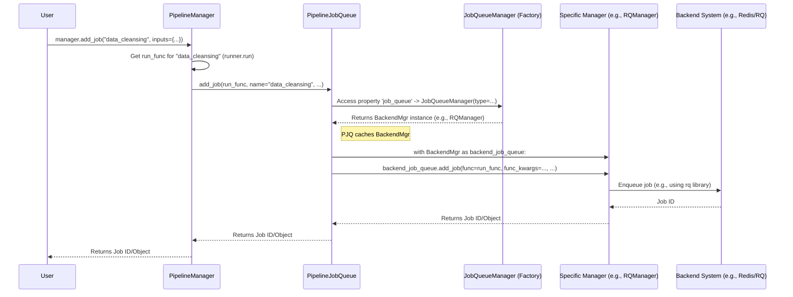

# Chapter 8: The Task Dispatcher and Calendar - JobQueueManager / PipelineJobQueue

Welcome to the final chapter covering the core concepts of `flowerpower`! In [Chapter 7: Optional Upgrades - Adapters (Hamilton Integration)](07_adapters__hamilton_integration_.md), we learned how to add powerful features like progress bars and tracking to our pipeline runs using Adapters, often just by changing configuration.

So far, we've mostly seen how to run pipelines immediately using `manager.run()` and wait for them to finish. But what if a pipeline takes a very long time? Or what if you need a pipeline to run automatically every day, like a cleanup task or a daily report?

## What's the Problem?

Running pipelines comes with different needs:

1.  **Long-Running Pipelines:** Some pipelines, like training a complex machine learning model or processing huge datasets, can take hours. Running `manager.run()` would tie up your terminal or script, preventing you from doing anything else until it finishes.
2.  **Regular Tasks:** Many pipelines need to run on a schedule. For example, fetching new data every night, generating a report every morning, or cleaning up temporary files weekly. Manually triggering these is tedious and unreliable.

**Use Case:**
Let's say our `data_cleansing` pipeline takes 3 hours to run. How can we start it and immediately get back to work, letting it run in the background? Also, how can we make sure our `daily_report` pipeline runs automatically every weekday at 8:00 AM?

We need a way to tell `flowerpower`: "Run this pipeline later" or "Run this pipeline repeatedly according to this schedule."

## Meet the Dispatcher and Calendar: `JobQueueManager` and `PipelineJobQueue`

`flowerpower` handles background jobs and scheduling using two cooperating components:

1.  **`JobQueueManager` (The Tool Selector):**
    *   This component acts like a factory. Its job is to provide access to different *backend systems* that can handle background tasks and scheduling. `flowerpower` supports popular tools like RQ (which uses Redis) and APScheduler (which can use databases or memory).
    *   Based on your project's configuration (usually in `conf/project.yml`'s `job_queue.type` setting from [Chapter 3: Configuration](03_configuration__config___projectconfig___pipelineconfig__.md)), the `JobQueueManager` gives you the right tool for the job.
    *   **Analogy:** Think of the `JobQueueManager` as the person who decides *which* system to use for your request – maybe a simple "drop box" for tasks to be done soon (like RQ), or a detailed "calendar and planner" for scheduled tasks (like APScheduler).

2.  **`PipelineJobQueue` (The Assistant):**
    *   This component acts as the bridge between the [PipelineManager](02_pipelinemanager_.md) and the backend system chosen by the `JobQueueManager`.
    *   It provides convenient methods for the `PipelineManager` to use:
        *   `add_job(...)`: Tells the backend system to run a specific pipeline function *soon* (as a background job).
        *   `schedule(...)`: Tells the backend system to run a specific pipeline function according to a time schedule (like a cron job or a specific date/interval).
    *   **Analogy:** This is like the helpful assistant. You tell the `PipelineManager` ("Run this job now" or "Schedule this job"), the `PipelineManager` tells the `PipelineJobQueue` assistant, and the assistant uses the specific tool (`JobQueueManager`'s choice) to fulfill the request.

Together, they provide a flexible way to manage when and how your pipelines run, without you needing to write complex code for different background task systems.

## How to Use Background Jobs and Scheduling (Solving the Use Case)

You typically don't interact directly with `PipelineJobQueue` or `JobQueueManager`. Instead, you use methods directly on the [PipelineManager](02_pipelinemanager_.md), which delegates the work to `PipelineJobQueue`.

**1. Running the `data_cleansing` pipeline in the background:**

Instead of `manager.run()`, we use `manager.add_job()`. This sends the task to the configured background job system (e.g., RQ).

```python
from flowerpower.pipeline import PipelineManager

manager = PipelineManager()

# Assume project.yml has job_queue.type: rq (or similar)
print("Adding data_cleansing job to the background queue...")

# 'add_job' returns quickly with a job ID
job_info = manager.add_job(
    name="data_cleansing",
    inputs={"source_file": "large_dataset.parquet"}
)

print(f"Job added! ID: {job_info.id}") # Or just job_info for some backends
print("Your script can now continue while the job runs.")
# To check status later, you might use other CLI commands or tools
# specific to your chosen backend (RQ, APScheduler).
```

*Explanation:*
*   We call `manager.add_job()` with the pipeline name and any inputs.
*   The `PipelineManager` asks `PipelineJobQueue` to handle this.
*   `PipelineJobQueue` uses the configured backend (let's say RQ) to put the `data_cleansing` task onto a queue processed by separate "worker" processes.
*   The `add_job` call returns almost immediately, giving you a job ID. Your main script doesn't wait for the 3-hour pipeline to finish.

*Example Output (Console):*
```
Adding data_cleansing job to the background queue...
✅ Successfully added job for [blue]my_project.data_cleansing[/blue] with ID [green]a1b2c3d4-e5f6-7890-1234-567890abcdef[/green] and result TTL of 120 seconds.
Job added! ID: a1b2c3d4-e5f6-7890-1234-567890abcdef
Your script can now continue while the job runs.
```
*(Note: You need to have background workers running separately to actually process these jobs. See `flowerpower job-queue start-worker` in the FlowerPower CLI docs).*

**2. Scheduling the `daily_report` pipeline:**

We use `manager.schedule()` and provide a scheduling rule, like a cron string.

```python
from flowerpower.pipeline import PipelineManager

manager = PipelineManager()

# Assume project.yml has job_queue.type: apscheduler (or similar)
print("Scheduling the daily_report pipeline...")

# 'schedule' adds the task to the backend's schedule list
schedule_id = manager.schedule(
    name="daily_report",
    cron="0 8 * * 1-5", # 8:00 AM on Monday to Friday
    # We could also override inputs here if needed
    # inputs={"output_format": "xlsx"}
)

print(f"Pipeline scheduled! Schedule ID: {schedule_id}")
print("The pipeline will run automatically according to the cron schedule.")
```

*Explanation:*
*   We call `manager.schedule()` with the pipeline name and a `cron` string. Cron is a standard way to define time schedules (`minute hour day month weekday`). `0 8 * * 1-5` means "at minute 0 of hour 8, on any day of the month, any month, but only on weekdays 1 through 5 (Monday-Friday)".
*   The `PipelineManager` asks `PipelineJobQueue` to register this schedule with the backend (e.g., APScheduler).
*   The backend system will then trigger the `daily_report` pipeline automatically at the specified times.

*Example Output (Console):*
```
Scheduling the daily_report pipeline...
✅ Successfully scheduled job for [blue]my_project.daily_report[/blue] with ID [green]daily_report-1[/green]
Pipeline scheduled! Schedule ID: daily_report-1
The pipeline will run automatically according to the cron schedule.
```
*(Note: You need a scheduler process running for the backend (e.g., `flowerpower job-queue start-scheduler` for RQ, or just workers for APScheduler) to trigger these scheduled jobs).*

You can also schedule based on intervals (`interval="1h"`) or specific dates (`date="2024-12-25T09:00:00"`). These settings can often be defined directly in the pipeline's configuration file (`conf/pipelines/daily_report.yml` under the `schedule` key) as covered in [Chapter 3: Configuration](03_configuration__config___projectconfig___pipelineconfig__.md)).

## Under the Hood: How the Assistant Uses the Tools

Let's trace what happens internally when you call `manager.add_job("data_cleansing")`.

**1. Initialization:**
When you create the `PipelineManager`, it also creates its helper components, including `PipelineJobQueue`.

```python
# Simplified from src/flowerpower/pipeline/manager.py
class PipelineManager:
    def __init__(self, ..., job_queue_type: str | None = None):
        # ... load project_cfg ...
        # ... setup filesystem (self._fs) ...

        self.job_queue = PipelineJobQueue(
            project_cfg=self.project_cfg, # Pass project settings
            fs=self._fs,
            cfg_dir=self._cfg_dir,
            pipelines_dir=self._pipelines_dir,
            # Pass any override for the job queue type
            job_queue_type=job_queue_type
        )
        # ... other components (Registry, Visualizer, IO) ...
```
*Explanation:* The `PipelineManager` sets up the `PipelineJobQueue` assistant, giving it the project context and noting which job queue system (`job_queue_type`) the project wants to use (e.g., 'rq').

**2. Getting the Backend Tool (Lazy Initialization):**
The `PipelineJobQueue` doesn't immediately connect to RQ or APScheduler. It waits until it's actually needed. It uses a property called `job_queue` for this.

```python
# Simplified from src/flowerpower/pipeline/job_queue.py
from ..job_queue import JobQueueManager # The factory

class PipelineJobQueue:
    def __init__(self, project_cfg: ProjectConfig, ...):
        self.project_cfg = project_cfg
        # Store the type name ('rq', 'apscheduler', etc.)
        self._job_queue_type = project_cfg.job_queue.type or settings.DEFAULT_JOB_QUEUE
        self._cached_job_queue = None # Cache for the actual queue manager

    @property
    def job_queue(self):
        """Lazily instantiate and cache a Job queue instance."""
        if self._cached_job_queue is None:
            logger.debug(f"Instantiating job queue of type: {self._job_queue_type}")
            # Use the factory to get the specific backend manager (e.g., RQManager)
            self._cached_job_queue = JobQueueManager(
                type=self._job_queue_type,
                fs=self._fs, # Pass filesystem access
                # Other necessary config from self.project_cfg maybe passed here
            )
        return self._cached_job_queue
```
*Explanation:* The first time `pipeline_job_queue_instance.job_queue` is accessed, it calls the `JobQueueManager` factory, asking for a manager of the configured `type` (e.g., 'rq'). The factory returns the specific manager (like an `RQManager` instance), which is then cached in `_cached_job_queue` for future use.

**3. The `add_job` Call:**
When `manager.add_job("data_cleansing", ...)` is called:

*   The `PipelineManager` first gets the *function* that actually runs the pipeline. This is typically the `run` method of a configured [PipelineRunner](04_pipelinerunner_.md) instance. Let's call this `run_func`.
*   The `PipelineManager` calls `self.job_queue.add_job(run_func=run_func, name="data_cleansing", inputs=...)`.
*   Inside `PipelineJobQueue.add_job`:

```python
# Simplified from src/flowerpower/pipeline/job_queue.py
class PipelineJobQueue:
    # ... (__init__, job_queue property) ...

    def add_job(
        self,
        run_func: Callable, # The function to run (e.g., runner.run)
        name: str,
        inputs: dict | None = None,
        # ... other params like final_vars, config overrides ...
        result_ttl: int = 120,
        **kwargs, # Backend-specific options
    ) -> Any:
        logger.debug(f"Adding immediate job with result TTL for pipeline: {name}")

        # Package arguments meant for the run_func
        pipeline_run_args = {
            "inputs": inputs,
            # ... package other args ...
        }
        # Remove None values to avoid passing them
        pipeline_run_args = {k: v for k, v in pipeline_run_args.items() if v is not None}

        # Get the backend-specific manager (e.g., RQManager)
        # using the lazy property we saw earlier
        specific_manager = self.job_queue

        # Use the specific manager's context manager for setup/teardown
        with specific_manager as backend_job_queue:
            # Delegate the actual job submission to the backend manager
            job = backend_job_queue.add_job(
                func=run_func,          # The target function
                func_kwargs=pipeline_run_args, # Args for the target function
                result_ttl=result_ttl,  # Arg for the queuing system
                **kwargs,               # Other backend-specific args
            )
        # ... (print success message) ...
        return job # Return the job ID or object
```
*Explanation:*
1.  It packages the arguments needed by the pipeline's `run` function (`pipeline_run_args`).
2.  It gets the specific backend manager (e.g., `RQManager`) by accessing the `self.job_queue` property.
3.  It uses a `with` statement (context manager) provided by the backend manager to handle connections or setup.
4.  It calls the `add_job` method on the *backend-specific manager* (e.g., `RQManager.add_job`), passing the target function (`run_func`), its arguments (`pipeline_run_args`), and any options for the job queue system itself (like `result_ttl`).
5.  The backend-specific manager (e.g., `RQManager`) then interacts with the actual library (e.g., `python-rq`) to enqueue the job.

The `schedule` method works very similarly, packaging the arguments and delegating to the `schedule` method of the specific backend manager obtained via `self.job_queue`.

**Sequence Diagram:**



This shows how the request flows from the user through the `PipelineManager` to the `PipelineJobQueue`, which uses the `JobQueueManager` factory to get the right tool (`BackendMgr`) and delegates the task to it.

## Conclusion

You've reached the end of our core concept tour! In this chapter, you learned how `flowerpower` handles running pipelines in the background or on a schedule:

*   **Problem Solved:** Avoids blocking your work for long pipelines and automates recurring tasks.
*   **`JobQueueManager`:** Acts as a **factory**, selecting the backend system (like RQ or APScheduler) based on configuration (`project.yml`).
*   **`PipelineJobQueue`:** Acts as the **assistant** or bridge, used by the [PipelineManager](02_pipelinemanager_.md) to interact with the chosen backend.
*   **Key Methods:**
    *   `manager.add_job(...)`: Runs a pipeline soon in the background.
    *   `manager.schedule(...)`: Runs a pipeline based on time (cron, interval, date).
*   **Flexibility:** Easily switch between different background task systems (RQ, APScheduler) by changing the `job_queue.type` in your `project.yml` without altering your `manager.add_job` or `manager.schedule` calls.

This abstraction makes it convenient to manage how and when your pipelines execute, keeping your interactions simple while supporting powerful backend systems.

This concludes the main chapters walking through the fundamental building blocks of `flowerpower`. With these concepts, you should have a good foundation for understanding, using, and building pipelines with the framework!

---

Generated by [AI Codebase Knowledge Builder](https://github.com/The-Pocket/Tutorial-Codebase-Knowledge)