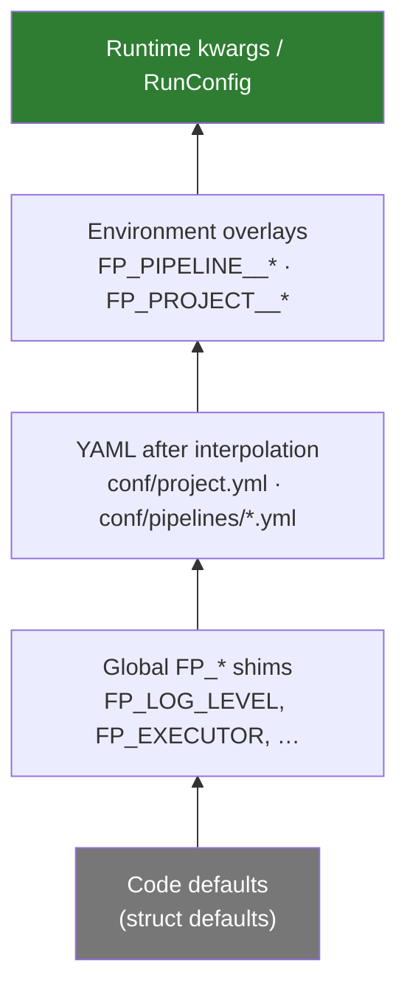

# Configuration & Concepts

This page explains *how* FlowerPower's configuration works and the concepts
behind it. For a step-by-step build, see the [Tutorial](quickstart.md); for
specific tasks, see the [How-to guides](guide/additional-modules.md).

## The layered configuration model

FlowerPower resolves every setting through a **precedence ladder**. The first
level that provides a value wins:



| # | Layer | What it is |
|---|-------|------------|
| 1 | **Runtime kwargs / `RunConfig`** | Passed to `project.run(...)` / `pm.run(...)`. Always wins. |
| 2 | **Environment overlays** | `FP_PIPELINE__*` / `FP_PROJECT__*` (nested via `__`). |
| 3 | **YAML (after interpolation)** | `conf/project.yml` and `conf/pipelines/<name>.yml`, with `${VAR}` expanded. |
| 4 | **Global env shims** | `FP_LOG_LEVEL`, `FP_EXECUTOR`, … applied only when no more-specific key is set. |
| 5 | **Code defaults** | Struct field defaults. |

### Project vs. pipeline config

- **`conf/project.yml`** — project-wide settings: name and the `adapter` block
  (Hamilton Tracker, MLflow, Ray connection details).
- **`conf/pipelines/<name>.yml`** — per-pipeline settings: `params`, `run`
  (execution), and pipeline-level `adapter` overrides.

```yaml
# conf/pipelines/hello.yml
params:                 # values injected into your functions
  greeting_message:
    message: "Hello"
run:
  final_vars: [full_greeting]   # which nodes to return
  executor:
    type: threadpool
    max_workers: 4
  retry:
    max_retries: 3
    retry_delay: 1.0
```

## How parameters reach your functions

In a pipeline module, this line loads the YAML `params:` block into Hamilton's
parameter format:

```python
from flowerpower.cfg import Config

PARAMS = Config.load(
    Path(__file__).parents[1], pipeline_name="hello"
).pipeline.h_params
```

`PARAMS` is a **dictionary**. Each top-level key maps a function name to that
function's keyword arguments. Connect them with Hamilton's `@parameterize`:

```python
@parameterize(**PARAMS["greeting_message"])
def greeting_message(message: str) -> str:
    return f"{message},"
```

!!! warning "Use dictionary access"
    Write `PARAMS["greeting_message"]`, **not** `PARAMS.greeting_message`.
    `h_params` is a plain dict; attribute access raises `AttributeError`.

Hamilton reads function signatures to build the DAG — it never runs a node
until something depends on it. You select the nodes to actually compute via
`run.final_vars`.

## Environment overlays

You can override any nested config value with environment variables, using
double-underscore as the path separator:

| Variable | Sets |
|----------|------|
| `FP_PIPELINE__RUN__LOG_LEVEL=DEBUG` | `run.log_level` |
| `FP_PIPELINE__RUN__EXECUTOR__TYPE=threadpool` | `run.executor.type` |
| `FP_PROJECT__ADAPTER__HAMILTON_TRACKER__API_URL=…` | project adapter URL |

Values are type-coerced (bool / int / float) and JSON is accepted for
objects/lists. Global shims like `FP_LOG_LEVEL` and `FP_EXECUTOR` still work,
but only when no more-specific overlay key is present.

### YAML interpolation

YAML values support Docker Compose–style expansion:

```yaml
run:
  log_level: ${FP_LOG_LEVEL:-INFO}
  executor: ${FP_PIPELINE__RUN__EXECUTOR:-{"type":"threadpool"}}
params:
  data_path: ${DATA_PATH:-data/input.csv}
adapter:
  hamilton_tracker:
    api_key: ${HAMILTON_API_KEY:?Missing tracker key}
```

Supported forms: `${VAR}`, `${VAR:-default}` (unset or empty), `${VAR-default}`
(unset), `${VAR:?err}` / `${VAR!err}` (require). `$${...}` escapes the `$`.
Expanded JSON becomes a typed value.

## Running with `RunConfig`

`RunConfig` bundles execution settings. Pass it to `run()`, or override
individual fields as kwargs (kwargs win):

```python
from flowerpower import FlowerPowerProject
from flowerpower.cfg.pipeline.run import RunConfig

project = FlowerPowerProject.load(".")

result = project.run(
    "hello",
    run_config=RunConfig(inputs={"greeting_message": {"message": "Hi"}}, log_level="DEBUG"),
    final_vars=["full_greeting"],   # overrides the RunConfig field
)
```

### `RunConfigBuilder`

For complex runs, the fluent builder is clearer:

```python
from flowerpower.utils.config import RunConfigBuilder

cfg = (
    RunConfigBuilder()
    .with_inputs({"greeting_message": {"message": "Hi"}})
    .with_final_vars(["full_greeting"])
    .with_log_level("DEBUG")
    .with_retries(max_attempts=3, delay=1.0)
    .with_executor({"type": "threadpool", "max_workers": 4})
    .build()
)
result = project.run("hello", run_config=cfg)
```

Key `RunConfig` fields: `inputs`, `final_vars`, `config`, `cache`, `executor`,
`with_adapter`, `retry`, `log_level`, `reload`, `additional_modules`,
`on_success`, `on_failure`, `async_driver`. See the
[RunConfig reference](api/runconfig.md) for the complete list.

## Executors

The `run.executor` block (or `executor_cfg=` kwarg) chooses how Hamilton runs
the DAG:

- **`threadpool`** (default) — multi-threaded, good for I/O-bound nodes.
- **`local`** — single-process, useful for CPU-bound / simple pipelines.
- **Ray** — distributed; needs the `[ray]` extra and the Ray adapter enabled.

```python
project.run("hello", executor_cfg={"type": "threadpool", "max_workers": 8})
```

## Retries & callbacks

Retry behavior lives in the nested `retry` block
(`max_retries`, `retry_delay`, `jitter_factor`, `retry_exceptions`):

```python
from flowerpower.cfg.pipeline.run import RunConfig

project.run(
    "flaky_pipeline",
    run_config=RunConfig(
        retry={"max_retries": 5, "retry_delay": 2.0, "jitter_factor": 0.2},
        on_success=lambda: print("done"),
    ),
)
```

!!! note "Deprecated retry fields"
    The top-level `max_retries` / `retry_delay` / `jitter_factor` /
    `retry_exceptions` fields still work but emit a `DeprecationWarning`. Use the
    nested `retry` block instead.

`on_success` / `on_failure` accept a callable, or a
`(callable, args_tuple, kwargs_dict)` tuple.

## Caching

Set `cache: true` (or a dict like `{"recompute": ["node1", "final_node"]}`) to
reuse results of previously computed nodes across runs.

## Composing modules

A pipeline can pull nodes from additional Python modules via
`additional_modules` — handy for shared setup/teardown or team ownership:

```python
project.run("hello", additional_modules=["setup"], final_vars=["full_greeting"])
```

See [Compose Multiple Modules](guide/additional-modules.md) for resolution rules
and reload behaviour.

## Adapters

Track runs or distribute work by enabling adapters at run time. The toggle field
is **`hamilton_tracker`** (not `tracker`):

```python
project.run("hello", with_adapter_cfg={"hamilton_tracker": True, "mlflow": False})
```

See [Use Adapters](guide/adapters.md) for full configuration.

## Filesystem abstraction & security

FlowerPower reads and writes through [fsspeckit](https://legout.github.io/fsspeckit),
so the same project can live on local disk, S3, GCS, and more. Pass
`storage_options` and a `base_dir` with a protocol (e.g. `s3://bucket/proj`).

All file paths are validated to prevent directory traversal:

```python
from flowerpower.utils.security import SecurityError, validate_file_path

validate_file_path("data/input.csv")          # OK
validate_file_path("../../../etc/passwd")      # raises SecurityError
```

## I/O plugins

Install the `flowerpower-io` plugin (`uv pip install 'flowerpower[io]'`) to read
and write CSV, JSON, Parquet, DeltaTable, DuckDB, PostgreSQL, MySQL, MSSQL,
Oracle, SQLite, and MQTT. See the
[flowerpower-io docs](https://legout.github.io/flowerpower-io).
