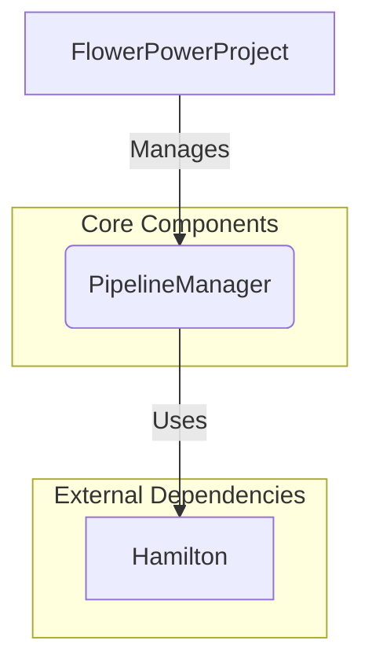

# Architecture Overview

## Introduction

Welcome to the architectural overview of FlowerPower. This document provides a high-level look at the library's design, its core components, and the principles that guide its development. Our goal is to create a powerful, flexible, and easy-to-use platform for building data pipelines.

## Core Design Principles

FlowerPower is built on a foundation of modularity and clear separation of concerns. Key design principles include:

-   **Modular and Configuration-Driven:** Components are designed to be self-contained and configurable, allowing you to easily swap implementations and adapt the library to your needs.
-   **Unified Interface:** A single, clean entry point (`FlowerPowerProject`) simplifies interaction with the library's powerful features.
-   **Extensibility:** The library is designed to be extended with custom plugins and adapters for I/O, messaging, and more.

## Key Components

The library's architecture is centered around a few key components that work together to provide a seamless experience.

### `FlowerPowerProject`

The `FlowerPowerProject` class is the main entry point and public-facing API of the library. It acts as a facade, providing a unified interface to the underlying `PipelineManager`. This simplifies the user experience by abstracting away the complexities of the individual components.

### `PipelineManager`

The `PipelineManager` is responsible for everything related to data pipelines:

-   **Configuration:** It loads and manages pipeline definitions from YAML files.
-   **Execution:** It uses the Hamilton library to execute dataflows defined as a Directed Acyclic Graph (DAG) of Python functions.
-   **Visualization:** It provides tools for visualizing pipeline graphs.
-   **I/O:** It handles data loading and saving through an extensible system of I/O adapters.

#### Hamilton Integration

FlowerPower leverages Hamilton to define the logic of its data pipelines. Hamilton's declarative, function-based approach allows you to define complex dataflows in a clear and maintainable way. Each function in a Hamilton module represents a node in the DAG, and Hamilton automatically resolves the dependencies and executes the functions in the correct order.

!!! note
    To learn more about Hamilton, visit the [official documentation](https://hamilton.dagworks.io/).

## Filesystem Abstraction

FlowerPower includes a filesystem abstraction layer that allows you to work with local and remote filesystems (e.g., S3, GCS) using a consistent API. This makes it easy to build pipelines that can read from and write to various storage backends without changing your core logic.

## Conclusion

FlowerPower's architecture is designed to be both powerful and flexible. By leveraging Hamilton for dataflow definition, it provides a comprehensive solution for a wide range of data-intensive applications. The modular design and unified interface make it easy to get started, while the extensible nature of the library allows it to grow with your needs.