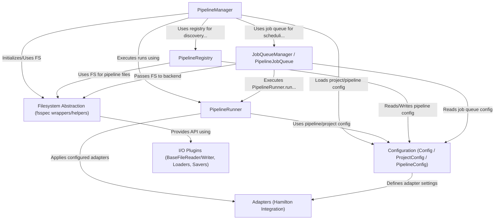

# Tutorial: flowerpower

*FlowerPower* helps you build, run, and manage data pipelines.
Think of it as a control center (**PipelineManager**) for your data workflows.
It uses pipeline definitions (like recipes, managed by **PipelineRegistry**) and configurations (**Configuration**) to know *what* to run.
The actual execution is handled by a **PipelineRunner**, which can use extra tools (**Adapters**) like progress bars.
Pipelines can be run as background tasks using a **JobQueueManager**.
The project interacts with files consistently using a **Filesystem Abstraction**, regardless of where they are stored (local, S3, etc.).
Specific file types (like CSV or Parquet) and databases are handled by **I/O Plugins**.

**Source Repository:** [None](None)

## Chapters

1. [PipelineRegistry
](01_pipelineregistry_.md)
2. [PipelineManager
](02_pipelinemanager_.md)
3. [Configuration (Config / ProjectConfig / PipelineConfig)
](03_configuration__config___projectconfig___pipelineconfig__.md)
4. [PipelineRunner
](04_pipelinerunner_.md)
5. [Filesystem Abstraction (fsspec wrappers/helpers)
](05_filesystem_abstraction__fsspec_wrappers_helpers__.md)
6. [I/O Plugins (BaseFileReader/Writer, Loaders, Savers)
](06_i_o_plugins__basefilereader_writer__loaders__savers__.md)
7. [Adapters (Hamilton Integration)
](07_adapters__hamilton_integration__.md)
8. [JobQueueManager / PipelineJobQueue
](08_jobqueuemanager___pipelinejobqueue_.md)

---

Generated by [AI Codebase Knowledge Builder](https://github.com/The-Pocket/Tutorial-Codebase-Knowledge)